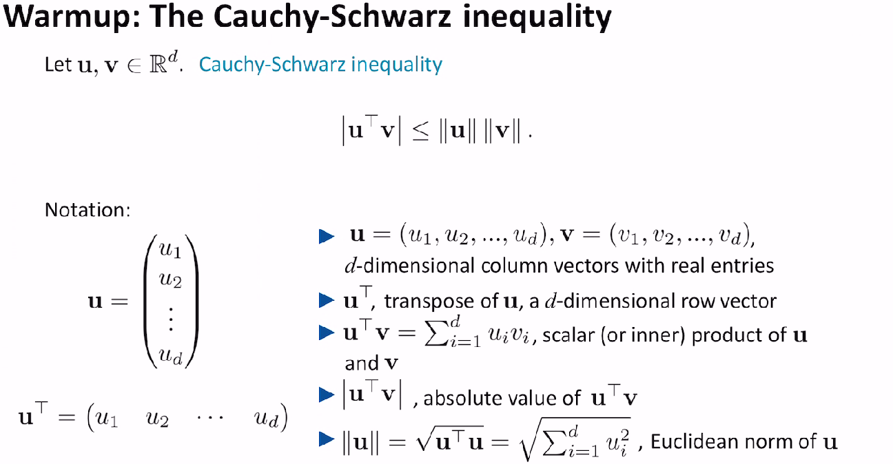
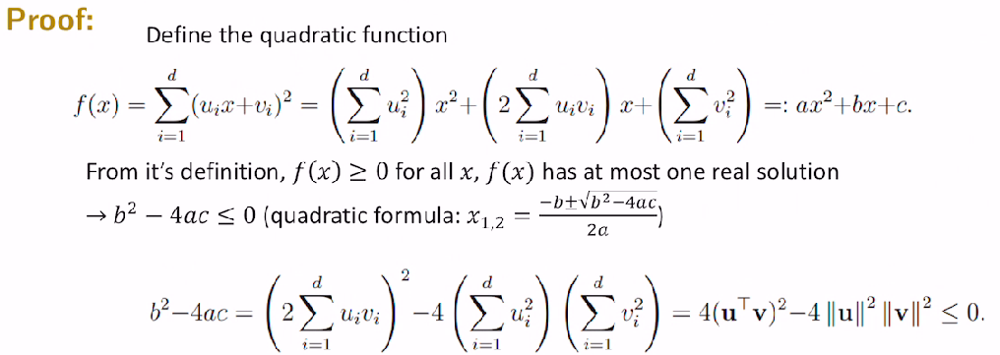
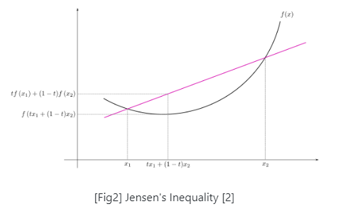
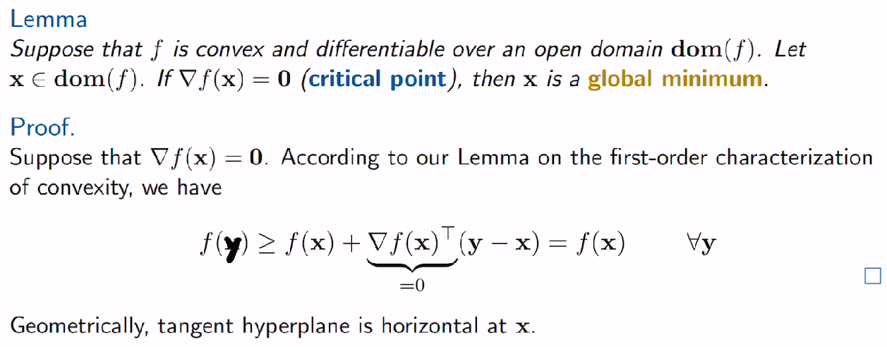

## 최적화 수업 0906

## 0906 수업요약

## Convex Sets & Convex functions

## Relation between a convex set and a convex function

**함수 f 의 epigraph가 convex set일때, 함수 f 는 convex function이다.**

epigraph 란? 

​	epi : above, 즉 그래프 위쪽 영역

역도 성립, 함수 **f가 convex function일때 epi (f)는 항상 convex set**.

- Optimization 문제를 convex function으로 변환하면 쉽게 풀 수 있다. 하지만, 가끔씩 내가 풀려는 문제가 convex function로 정의된 것인지 판단하기 어려울 때가 있다. 이럴 때는 함수의 epigraph가 convex set인지를 확인해서 convex function임을 판별할 수가 있다.

## examples of convex functions

##  Jensen's inequality

example ) 함수 f 가 convex 이면 다음이 성립.

## Convex functions are continuous

만약

1) f: convex function

2) dom(f) is open

   -> f is continuous

## First-order Characterization of convexity

##### 

graph f is abobe all its **tangent hyperplanes**

## Second-order Characterization of convexity

## Operations that preserve convexity

여기서는 convex function 의 convexity를 유지하는 연산에 대해 살펴본다. Convex fnuction의 Convexity를 유지하는 연산에는 다음과 같은 것들이 있다.

lemma (i)는 **nonnegative linear combination**으로 *convex f함수들*에 음수가 아닌 *람다*에 대한 선형 조합들은 **convex**이다.

lemma(ii)는 m차원->d차원 으로 매핑하는 함수 *g(x) = Ax+b* 가 있을때 *f(Ax+b)* 는 **convex**이다. 

## Local minima are Global minima

로컬 미니멈 정의와,  **컨백스 함수에서는 로컬 미니멈이 글로벌 미니멈** 에 대한 증명.

## Critical Points are Global minima

**함수가 open domain에 미분가능 할 때** 

**critical points(임계점) 일때 -> Global minimum 이다.**

이는 *First-order characterization of convexity* 이용해서 증명가능.

---

1일차 수업 끝.

