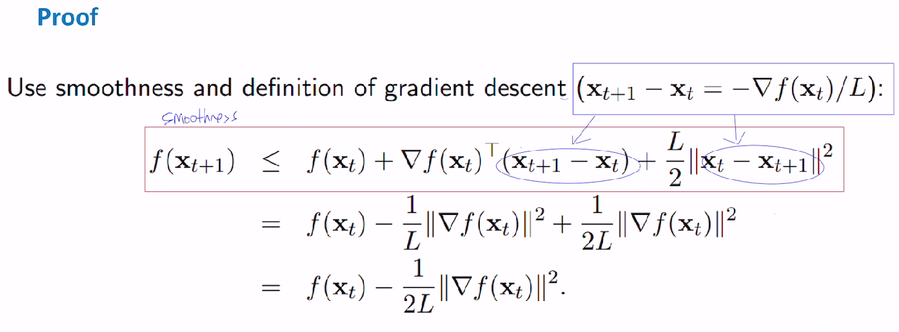

# 최적화 수업 0913

---

## Strictly Convex function

strictly convex function 정의, 글로벌 미니멈 한개임.

## Constrained minimization

함수 f 가 convex 이고 ,  dom(f)[convex set] 일때 minimizer x 의 정의. 

lemma는 밑에 그림보면 수식 이해감. 

## Existence of minimizer

그럼 global minimum 존재 어떻게 알아?

### The Weierstrass Theorem

---

lec(2) 강의노트.

## The Algorithm

 

iterative algorithm 사용해서 찾을 수 있겠군. 

하지만 장단점 존재

### Quadratice example

## Vanilla analysis

vanilla analysis로 인해서

 **평균 오차에 대한 upper bound**가 나옴. 

이는  **gradient, initial point, step-size** 에 의해서 결정이 된다.

## Lipschitz convex functions

*(STEP SIZE를 고르는 방법은 크게 fixed step size를 취하는 방법과, 매번 optimal한 step size를 고르는(update 하는) line search 방법이 있다.)*

먼저 fixed step size에 대해 살펴보자. 

앞선 평균 오차 때문만 아니라 step size를 잘 잡는것은 매우 중요하다. 너무 큰 step size 잡으면 algorithm이 diverge 하고, 작게 잡으면 느리기 때문이다. 그래서 step size를 잘 잡는게 중요한데, 다행이 어떤 적절한 step size에 대해 algorithm이 strictly convex function f의 global unique optimum으로 수렴한다는 것을 증명할 수 있다. 

적절한 step size에 대해 설명을 하려면 먼저 L-Lipschitz function이라는 것을 정의해야하는데, 이는 다음과 같이 정의된다.

{:.align-center}

L은  함수가 얼마나 빨리변하는지를 나타낸다.

 f가 L-Lipschitz function이고 어떤 optimum이 존재한다면  r(fixed step size) ≤2/L 을 취했을 때 gradient descent algorithm이 stationary point로 수렴하게 된다는 것을 증명할 수 있다. 

평균값 정리 이용해서 표현가능.

앞서 말한 적절한 step size를 구하기 위한 Theorem 이다.

함수 f가 convex이고 global minimum x* 에서 미분가능 할 때, x0(initial)-x*(minimizer)차이가 R 이하, 그래디언트가 B이하 일 때

step size를 R/B(sqrt(T)) 로 잡으면 , average error(normalization한)는 upper bound 를 가진다.

증명은 앞선 Vanilla Analysis 에서 추가된 가정들을 넣고, upper bound를 최소화 하기 위해 step size에 대해 미분을 한다.

그리고 upper bound 의 최솟값을(step size에 대한) 넣어주고 양 변을 T로 나누면 된다. ㄴ

하지만

  R(x0(initial)-x*(minimizer)차이 upper bound) ,  B(그래디언트놈 upper bound)  알 수가 없다.

## Smooth functions

## sufficient decrease

## Smooth *Convex* functions

step size를 L로 잡는다면? (현재 함수값 - 최소 함수값) upper bound가 나오네.

---

토->일 멈춤.

