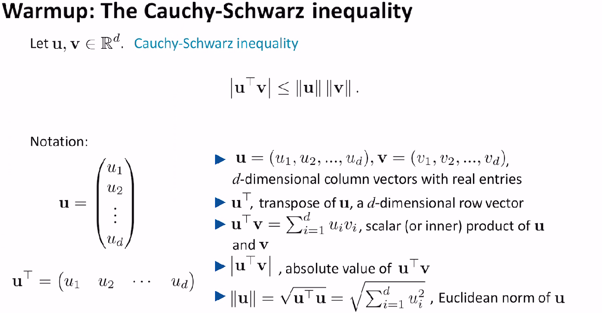
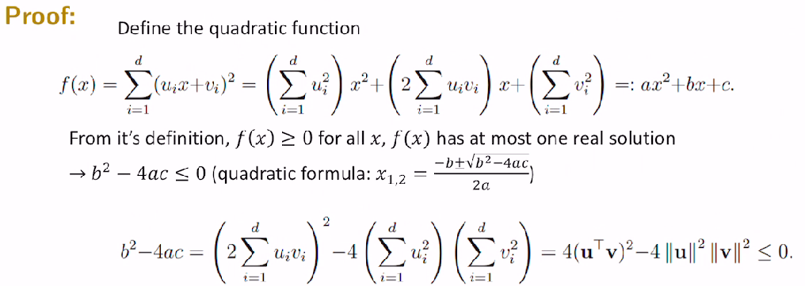
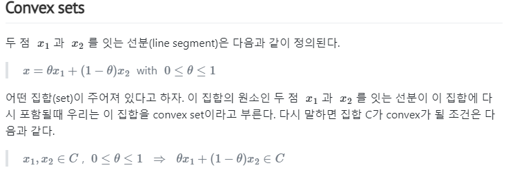

## 최적화 수업 0913

## -0906 수업요약
check1

## Convex Sets & Convex functions

## Relation between a convex set and a convex function

**함수 f 의 epigraph가 convex set일때, 함수 f 는 convex function이다.**

epigraph 란? 

​	epi : above, 즉 그래프 위쪽 영역

역도 성립, 함수 **f가 convex function일때 epi (f)는 항상 convex set**.

- Optimization 문제를 convex function으로 변환하면 쉽게 풀 수 있다. 하지만, 가끔씩 내가 풀려는 문제가 convex function로 정의된 것인지 판단하기 어려울 때가 있다. 이럴 때는 함수의 epigraph가 convex set인지를 확인해서 convex function임을 판별할 수가 있다.

실시간 반영가능?

