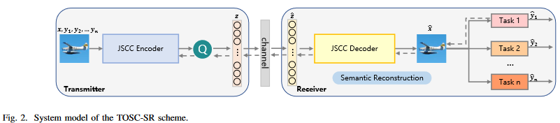
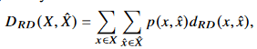

# [논문 리뷰] Task-Oriented Semantic Communication with Semantic Reconstruction: An Extended Rate-Distortion Theory Based Scheme


# Abstract


rate-distortion 이론을 multiple tasks로 확장하겠다.

**multiple task 를 위한 reconstruct images** 를 이용하겠다 > (특정한 rate에서) **generalization ability**를 높이겠다. 

그러기 위해서 **rate-distortion optimization problem** 으로 문제를 풀겠다 > loss function으로 설정하겠다.

function에서, 새로운 **semantic distortion measurement** 를 **mutual information(source, semantic-reconstructed images, task labels)**로 설정하겠다. 

relaxed version의 loss function을 **variational approximation of mutual information**을 통해 유도할 것이다. 

variational approximation은 사후확률(posterior)의 분포 p(z\x)를 다루기 쉬운 확률 분포 q(z)로 근사하는 걸 말한다. 사후확률 분포를 계산하는게 불가능에 가까울 정도로 어려운 경우가 많다고 한다.

[variational approximation 참고] (https://ratsgo.github.io/generative%20model/2017/12/19/vi/)

classification & objecet detection 을 task 로 generalizaiton ability를 입증한다.(classification으로 training하고 objection에서도 성능 잘 나오는걸 보여줌) 

proposed TOSC_SR scheme 은 기본 기법들과 , general reconstruction 기반 DNN 에 비해 좋은 성능을 보인다.

기존의 rate-distortion과 information bottleneck에 가이드된 통신 기법들에 비해, **multi-task generalization**에 높은 성능을 보인다.

# I. INTRODUCTION

시멘틱 커뮤니케이션의 goal은 심볼전송이 아니라 , 시멘틱 정보의 교환이다.

 semcom으로 인해 효율적 통신이 가능하다. 

전송 cost를 줄이는 것 뿐만 아니라, multi visual task에서의 성능을 높이기 위해 **task-oriented semcom에서, 소스에서 시멘틱 정보를 표현**하는것은 중요한 이슈이다.

얼마나 소스의 표현을 잘했냐를 평가하기 위해서는 **소스와 표현사이의 거리감**을 측정하는 **distortion measurement** 가 정의되어야 한다.

기존에는 rate-distortion theory에 의해, 주어진 rate(size of data representation after compression in order to meet the spectrum requirement)에서 예상되는 distortion의 minimum을 찾는식으로 진행되었다. 

image representation 에서는 distortion measurements를 3개 정도로 나눌 수 있다.

1. **reconstruction distortion**.

   **픽셀 단위**에서 reconstruction quality를 측정한다. 보통 원본과 reconstructed image의 pixel에서의 MSE를 측정한다. 이미지 압축은 보통 JPEG,JPEG2000 같은 handcrafted time-freq transforms에 기반하는데 최근에는 deep learning 기반 auto-encoder나 GAN을 이용해 압축하기도 한다. 이러한 deep learning 기반은 더 좋은 trade off[ (rate or representation size) & (reconstruction distortion) ]를 commit한다.

2. **feature distortion**

   feature distortion은 input source image 에서 extracted 된 feature 와 reconstructed image 에서 extracted 된 feature의  distance를 측정한다. distortion measurement에서 **global features of source를 reconstructed images에서 보존**하는 것이 목표이다. 

3. **semantic distortion**

   semantic distortion based communications 에서는 task domain에서 이미지는 압축된다. 기존에 픽셀이나 feature domain 에서 global information을 reconstruct하는게 아니고, **특정 specific 한 task에서 더 잘 수행하도록 semantic features들을 더 잘 capture 하자**는 것이다. 기존 IB(information bottleneck) distortion은 single specific task에서 proposed 되었다. 주어진 rate 상황에서 , IB distortion을 최소화하면 , 특정 task를 잘할 수 있는 관련된 semantic features를 얻게된다. 하지만 이렇게 하면 여러 task에서 generalization ability를 하락시킨다.

실제로는 다양한 tasks를 고려 해야 한다. 그래서 **소스 이미지의 generalized representation으로  이끄는 새로운 semantic distortion measurement이 필요**하다. 우리의 idea는 pixel 이나 feature domain에서 image reconstruction이 아니라, **특정 rate에서의 multiple tasks를 위한 semantic-reconstructed images의 generalization ability 상승과 각 task에서 효율적인 frequent representation전송을 위한 task domain 에서의 image reconstruction이다**.

### Main Contributions

- extended rate-distortion theory 기반 구조 (new semantic distortion measurement ). rate distortion optimization problem 으로  TOSC-SR를 formulating함으로써, optimal mapping(source & semantic-reconstructed images *by taking task labels into account*)를 결정하는 self-consistent equations를 얻을 수 있다. 

- TOSC-SR를 JSCC framework 에서 설계. variational approximation[9]에 기반하여 loss function의 relaxed version을 유도한다. 이 러한 relaxed version은 실제 training에 사용된다. loss function과 mutual information 사이의 관계를 유도한다[which gives the information theory explanation to semantic reconstruction]. MI estimator로 CLUB 을 사용한다.

- generalization ability 입증위해 , classification으로 training 후, object detection task에서 증명.

- 기존기법 대비 성능 좋게 나왔다. proposed scheme이 정보 이론 관점에서 효과적임을 보여주기 위해 mutual information estimation을 사용하였다.

 # II. RELATED WORK

### A. Definition and Measurement of Semantic Information

semcom에서 시멘틱 정보 정의와 측정은 key issue이다.

수식적으로 정의하는데 한계가 있음(같은 문장이여도 사람마다 다르게 받아들일 수 있으니까).요즘에는 DNN 이용해서 시멘틱 정보에대해 define, extract, and measure 하는 추세이다.  이러한 works 들에서 semantic은 특정 테스크와 관련된 소스로 부터의 features들로 고려된다. 이러한 정의들을 can be traced back to the IB theory(소스 안에 있는 task나 extracted features 에 관한 시멘틱 정보를 측정하기 위해  MI가사용되는 theory).하지만 high-dimensional variables 사이에서 MI 측정은 어렵다. 하지만 DNN 이용해서 MI estimation 할 수 있다. 이를 통해 (raw data와 task labels 간) 또는 (reconstructed signals와 task labels간) MI를 통해 시멘틱 정보의 양을 얻는것이 가능해진다. 

### B. Frameworks of Semantic Communication System


*Comparisons of different image communication frameworks with AI task*

- fig (a): general JSCC communication for image reconstruction in the pixel or feature domain,task로부터 feedback 없음, task와 관련된 시멘팅 정보 추출 고려되지 않음.

- fig (b): semantic communication for one specific task, without the need to reconstruct the original signal. 특정 task와 관련해서만 시멘틱 정보 추출, generalization ability 떨어짐.
- fig (c): semantic communication for multiple tasks with respective JSCC codecs. 
- fig (d): our proposed semantic communication for multiple tasks with one generalized JSCC codec. gradient feedback 이용해서 task 퍼포먼스를 유지시키는것 뿐만아니라, generalization ability를 높이도록 해야함.

### C. Image Compression and Semantic Representation

기존의 compression schemes들은 task performance의 집중하지 않고(image reconstruction without semantic) , 정확히 복원하는데에만 포커스 했다. DNN 발전으로 다양한 task에서 시멘틱 정보 추출은 많이 연구되어왔다. task들 마다 다른 시멘틱 representations를 필요로  하기 때문에, wireless transmission(limited transmission cost) 일때, 시멘틱 representations을 얼마나 효과적으로 얻느냐는 중요한 문제이다.

### D. Rate Distortion and Information Bottleneck

기존의 lossy image compression에서는 rate-distortion theory에 기반해 있었다.

**rate**는 **mutual information(source & representation)**로 정의되어 있었고,

**distortion**은 **difference(reconstructed images & original images , MSE) in the pixel or feature domain**으로 정의되어져 있었다.

extension of the rate-distortion theory로 IB problem이 *Thshby*에 의해 1999년에 proposed 되었다. 여기서 저자는 theoretic framework(source variable에 대한 task variable과 관련된 정확한 representation을 찾는)를 formulated하였다. IB distortion은 Mutual information( representation & task labels)의 확장으로 정의되었다.

최근에는 IB(information bottleneck)는  DNN의 optimization process을 설명하기 위해 사용되어왔다. 또한 the visual experiments in [45] 에서 optimization process는 optimization objective of IB에 해당한다는걸 증명했다.

이거에 영감을 받아 Alemi et al. [19]는 variational approximation to the IB를 도입하고, relaxed IB trade-off를 사용하여 DNN을 이용한  supervised learning 모델을  최적화하였다. 

 본 논문에서는 **generalization ability를 고려함으로써 rate-distortion theory를 extend**하였다.

**새로운 semantic distortion은 trade-off( semantic reconstructed distortion & IB distortion oriented towards tasks)**으로 정의되었다. 

# III. SYSTEM MODEL AND PROBLEM FORMULATION



predicting precision 과 generalization ability among multiple tasks 둘다 고려한다.

TOSC-SR은 extended rate-distortion problem으로 formulated되며, 이것에 대한 analytic solution은 equivalent Lagrange multiplier optimization problem을 풀어서 유도된다.

### A. System model

fig 2 와 같음 [JSCC encoder, quantizer, physical channel, JSCC decoder, AI task networks in the receiver]

- X : source image space
- Y : desired output of AI tasks
- Z : quantized symbols ( after semantic encoding & quantification)
- X^ : reconstructed image (after through physical channel & semantic reconstruction)
- Y^ : predicting result (input :X^인 AI task network의 output )


```python
quantization 하는 이유

제안된 framework는 semantic representation 에 quantization을 적용한다.
transmission cost를 줄이기 위해, 
채널 인풋 심볼들은 cost에 민감한 전송단의 finite precision waveform 에 매칭되기위해 quantified되어야 한다.
또 qunatization은 추후 분석에서 mutual information을 계산하는데 도움을 준다.
```

### B. Semantic Distortion Measurement

extended rate-distortion theory 기반 semantic distortion measurement 보이겠다.

요약하면, 기존 단일 task를 고려하던 IB problem에 generalization ability를 높이기 위한 항(D_RD)을 추가하여 optimization problem을 formulate 하겠다는 것이다. 




여기서 d_RD(x,x^)은 MSE : (x-x^)^2 로 설정. [RD: Reconstruction Distortion]

즉 semantic distortion measurement은 다음과 같다.


정확히 복원하는 것을 목표로 하는 D_RD 항이 generalization ability를 높이기 위한 항이긴 한데.. 의미가 있나?

아.. 만약에 특정 task들이 정해져있다면, 예를 들면 자율주행 상황에서 (위험신호감지, 신호등 변경, 앞/뒤 차 간의 거리) 정해져있다면 효과적일 순 있을 것 같다. 그러면 generalization 역활은 좀더 인간이 보고서도 판단할 수 있게끔 도와줄 수 있게 하거나, 또 다른 task 들이 추가됬을 때를 대비하는 건가..

