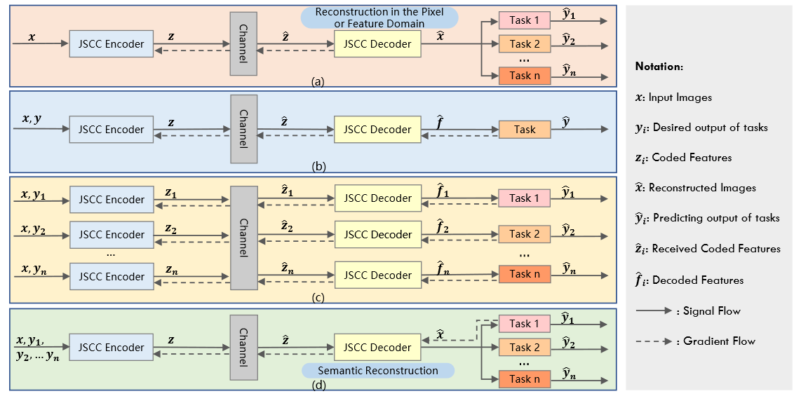
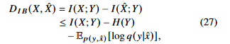

# [논문 리뷰] Task-Oriented Semantic Communication with Semantic Reconstruction: An Extended Rate-Distortion Theory Based Scheme


# Abstract


rate-distortion 이론을 multiple tasks로 확장하겠다.

**multiple task 를 위한 reconstruct images** 를 이용하겠다 > (특정한 rate에서) **generalization ability**를 높이겠다. 

그러기 위해서 **rate-distortion optimization problem** 으로 문제를 풀겠다 > loss function으로 설정하겠다.

function에서, 새로운 **semantic distortion measurement** 를 **mutual information(source, semantic-reconstructed images, task labels)**로 설정하겠다. 

relaxed version의 loss function을 **variational approximation of mutual information**을 통해 유도할 것이다. 

variational approximation은 사후확률(posterior)의 분포 p(z\x)를 다루기 쉬운 확률 분포 q(z)로 근사하는 걸 말한다. 사후확률 분포를 계산하는게 불가능에 가까울 정도로 어려운 경우가 많다고 한다.

[variational approximation 참고] (https://ratsgo.github.io/generative%20model/2017/12/19/vi/)

classification & objecet detection 을 task 로 generalizaiton ability를 입증한다.(classification으로 training하고 objection에서도 성능 잘 나오는걸 보여줌) 

proposed TOSC_SR scheme 은 기본 기법들과 , general reconstruction 기반 DNN 에 비해 좋은 성능을 보인다.

기존의 rate-distortion과 information bottleneck에 가이드된 통신 기법들에 비해, **multi-task generalization**에 높은 성능을 보인다.

# I. INTRODUCTION

시멘틱 커뮤니케이션의 goal은 심볼전송이 아니라 , 시멘틱 정보의 교환이다.

 semcom으로 인해 효율적 통신이 가능하다. 

전송 cost를 줄이는 것 뿐만 아니라, multi visual task에서의 성능을 높이기 위해 **task-oriented semcom에서, 소스에서 시멘틱 정보를 표현**하는것은 중요한 이슈이다.

얼마나 소스의 표현을 잘했냐를 평가하기 위해서는 **소스와 표현사이의 거리감**을 측정하는 **distortion measurement** 가 정의되어야 한다.

기존에는 rate-distortion theory에 의해, 주어진 rate(size of data representation after compression in order to meet the spectrum requirement)에서 예상되는 distortion의 minimum을 찾는식으로 진행되었다. 

image representation 에서는 distortion measurements를 3개 정도로 나눌 수 있다.

1. **reconstruction distortion**.

   **픽셀 단위**에서 reconstruction quality를 측정한다. 보통 원본과 reconstructed image의 pixel에서의 MSE를 측정한다. 이미지 압축은 보통 JPEG,JPEG2000 같은 handcrafted time-freq transforms에 기반하는데 최근에는 deep learning 기반 auto-encoder나 GAN을 이용해 압축하기도 한다. 이러한 deep learning 기반은 더 좋은 trade off[ (rate or representation size) & (reconstruction distortion) ]를 commit한다.

2. **feature distortion**

   feature distortion은 input source image 에서 extracted 된 feature 와 reconstructed image 에서 extracted 된 feature의  distance를 측정한다. distortion measurement에서 **global features of source를 reconstructed images에서 보존**하는 것이 목표이다. 

3. **semantic distortion**

   semantic distortion based communications 에서는 task domain에서 이미지는 압축된다. 기존에 픽셀이나 feature domain 에서 global information을 reconstruct하는게 아니고, **특정 specific 한 task에서 더 잘 수행하도록 semantic features들을 더 잘 capture 하자**는 것이다. 기존 IB(information bottleneck) distortion은 single specific task에서 proposed 되었다. 주어진 rate 상황에서 , IB distortion을 최소화하면 , 특정 task를 잘할 수 있는 관련된 semantic features를 얻게된다. 하지만 이렇게 하면 여러 task에서 generalization ability를 하락시킨다.

실제로는 다양한 tasks를 고려 해야 한다. 그래서 **소스 이미지의 generalized representation으로  이끄는 새로운 semantic distortion measurement이 필요**하다. 우리의 idea는 pixel 이나 feature domain에서 image reconstruction이 아니라, **특정 rate에서의 multiple tasks를 위한 semantic-reconstructed images의 generalization ability 상승과 각 task에서 효율적인 frequent representation전송을 위한 task domain 에서의 image reconstruction이다**.

### Main Contributions

- extended rate-distortion theory 기반 구조 (new semantic distortion measurement ). rate distortion optimization problem 으로  TOSC-SR를 formulating함으로써, optimal mapping(source & semantic-reconstructed images *by taking task labels into account*)를 결정하는 self-consistent equations를 얻을 수 있다. 

- TOSC-SR를 JSCC framework 에서 설계. variational approximation[9]에 기반하여 loss function의 relaxed version을 유도한다. 이 러한 relaxed version은 실제 training에 사용된다. loss function과 mutual information 사이의 관계를 유도한다[which gives the information theory explanation to semantic reconstruction]. MI estimator로 CLUB 을 사용한다.

- generalization ability 입증위해 , classification으로 training 후, object detection task에서 증명.

- 기존기법 대비 성능 좋게 나왔다. proposed scheme이 정보 이론 관점에서 효과적임을 보여주기 위해 mutual information estimation을 사용하였다.

 # II. RELATED WORK

### A. Definition and Measurement of Semantic Information

semcom에서 시멘틱 정보 정의와 측정은 key issue이다.

수식적으로 정의하는데 한계가 있음(같은 문장이여도 사람마다 다르게 받아들일 수 있으니까).요즘에는 DNN 이용해서 시멘틱 정보에대해 define, extract, and measure 하는 추세이다.  이러한 works 들에서 semantic은 특정 테스크와 관련된 소스로 부터의 features들로 고려된다. 이러한 정의들을 can be traced back to the IB theory(소스 안에 있는 task나 extracted features 에 관한 시멘틱 정보를 측정하기 위해  MI가사용되는 theory).하지만 high-dimensional variables 사이에서 MI 측정은 어렵다. 하지만 DNN 이용해서 MI estimation 할 수 있다(MINE < CLUB). 이를 통해 (raw data와 task labels 간) 또는 (reconstructed signals와 task labels간) MI를 통해 시멘틱 정보의 양을 얻는것이 가능해진다. 

### B. Frameworks of Semantic Communication System



*Comparisons of different image communication frameworks with AI task*

- fig (a): general JSCC communication for image reconstruction in the pixel or feature domain,task로부터 feedback 없음, task와 관련된 시멘팅 정보 추출 고려되지 않음.

- fig (b): semantic communication for one specific task, without the need to reconstruct the original signal. 특정 task와 관련해서만 시멘틱 정보 추출, generalization ability 떨어짐.
- fig (c): semantic communication for multiple tasks with respective JSCC codecs. 
- fig (d): our proposed semantic communication for multiple tasks with one generalized JSCC codec. gradient feedback 이용해서 task 퍼포먼스를 유지시키는것 뿐만아니라, generalization ability를 높이도록 해야함.

### C. Image Compression and Semantic Representation

기존의 compression schemes들은 task performance의 집중하지 않고(image reconstruction without semantic) , 정확히 복원하는데에만 포커스 했다. DNN 발전으로 다양한 task에서 시멘틱 정보 추출은 많이 연구되어왔다. task들 마다 다른 시멘틱 representations를 필요로  하기 때문에, wireless transmission(limited transmission cost) 일때, 시멘틱 representations을 얼마나 효과적으로 얻느냐는 중요한 문제이다.

### D. Rate Distortion and Information Bottleneck

기존의 lossy image compression에서는 rate-distortion theory에 기반해 있었다.

**rate**는 **mutual information(source & representation)**로 정의되어 있었고,

**distortion**은 **difference(reconstructed images & original images , MSE) in the pixel or feature domain**으로 정의되어져 있었다.

extension of the rate-distortion theory로 IB problem이 *Thshby*에 의해 1999년에 proposed 되었다. 여기서 저자는 theoretic framework(source variable에 대한 task variable과 관련된 정확한 representation을 찾는)를 formulated하였다. IB distortion은 Mutual information( representation & task labels)의 확장으로 정의되었다.

최근에는 IB(information bottleneck)는  DNN의 optimization process을 설명하기 위해 사용되어왔다. 또한 the visual experiments in [45] 에서 optimization process는 optimization objective of IB에 해당한다는걸 증명했다.

이거에 영감을 받아 Alemi et al. [19]는 variational approximation to the IB를 도입하고, relaxed IB trade-off를 사용하여 DNN을 이용한  supervised learning 모델을  최적화하였다. 

 본 논문에서는 **generalization ability를 고려함으로써 rate-distortion theory를 extend**하였다.

**새로운 semantic distortion은 trade-off( semantic reconstructed distortion & IB distortion oriented towards tasks)**으로 정의되었다. 

# III. SYSTEM MODEL AND PROBLEM FORMULATION


predicting precision 과 generalization ability among multiple tasks 둘다 고려한다.

TOSC-SR은 extended rate-distortion problem으로 formulated되며, 이것에 대한 analytic solution은 equivalent Lagrange multiplier optimization problem을 풀어서 유도된다.

### A. System model

fig 2 와 같음 [JSCC encoder, quantizer, physical channel, JSCC decoder, AI task networks in the receiver]

- X : source image space
- Y : desired output of AI tasks
- Z : quantized symbols ( after semantic encoding & quantification)
- X^ : reconstructed image (after through physical channel & semantic reconstruction)
- Y^ : predicting result (input :X^인 AI task network의 output )


```python
quantization 하는 이유

제안된 framework는 semantic representation 에 quantization을 적용한다.
transmission cost를 줄이기 위해, 
채널 인풋 심볼들은 cost에 민감한 전송단의 finite precision waveform 에 매칭되기위해 quantified되어야 한다.
또 qunatization은 추후 분석에서 mutual information을 계산하는데 도움을 준다.
```

### B. Semantic Distortion Measurement

extended rate-distortion theory 기반 semantic distortion measurement 보이겠다.

요약하면, 기존 단일 task를 고려하던 IB problem에 generalization ability를 높이기 위한 항(D_RD)을 추가하여 optimization problem을 formulate 하겠다는 것이다. 


relevant information distortion 인 d_IB(x,x^)과 IB distortion function 인 D_IB(x,x^) 은 다음과 같이 유도된다. 


바로 위에 있는 식은 relevant information의 reduction에 대해 더 직관적으로 알 수 있다. IB distortion function은 X,Y(desired task) 에 대한 상호 정보량과 JSCC 인코더 디코더를 통해 생성된 X^와 Y(desired task)에 대한 상호정보량의 차이를 나타낸다. 즉 최대한 X^이 X만큼 Y에 대한 정보를 가지고 있어야 IB distortion function이 작아짐을 알 수 있다.  해당 증명은 논문 Appendix A를 참고하자.

*information bottleneck 은 rate과 distortion가 trade-off 관계인데 distortion만 고려하는걸 information bottleneck problem이라고 할 수 있나? 그래서 relevant가 쓰인건가?*

그 다음은 generalization ability를 높이기 위해 추가한 RD(reconstruction distortion) function이다. 


여기서는 MSE를 사용하였다. 이름에서부터 알 수 있듯이, 얼마나 정확하게 복원하느냐 에 대한 함수이다.

앞서 구한 두 개의 distortion function을 더해 , 해당 논문에서 제시하는 **semantic distortion measurement**은 다음과 같이 제시된다.


*정확히 복원하는 것을 목표로 하는 D_RD 항이 generalization ability를 높이기 위한 항이긴 한데..그러면 그냥 MSE 만하면 되는거 아닌가? *

*.. 만약에 특정 tasks들이 정해져있다면, 예를 들면 자율주행 상황에서 (위험신호감지, 신호등 변경, 앞/뒤 차 간의 거리)과 같이 몇 개의 task들이 정해져있다면 효과적일 순 있을 것 같다. 그러면 generalization 역활은 좀더 인간이 보고서도 판단할 수 있게끔 도와줄 수 있게 하거나, 또 다른 task 들이 추가됬을 때를 대비하는 건가?..*

### C. Problem Formulation and Analytic Solution

위의 마지막 식 처럼 semantic distortion measurement가 정의되면, 우리의 TOSC-SR은 extended rate-distortion optimization problem(정확한 시멘틱 representation과 multi-task generalization ability의 trade-off를 위한)으로 formulated 될 수 있다. Analytic solution은 equivalent 라그랑지안 펑션을 풀어서 self-consistent equations 들을 유도해서 iterative algorithm(Blahut-Arimoto algorithm)을 통해 얻을 수 있다. 

먼저 semantic distortion 인 D_S 를 minimized 하는게 우리의 optimized objective이다.  가장 좋은 방법은 X=Z로 quantization를 identity mapping 하는 것이다. 하지만 실제 통신 시스템에서는 압축없이 전송하는 것은 wasteful하다.  rate distortion optimization과 비슷하게, 우리는 rate인  I(X;X^)를 constraint로 적용할 것이다. certain compression을 constraint로 한다는 뜻이다. 이는 다음과 같이 표현될 수 있다. 


그러면 우리는 다음과 같은 optimization problem을 가진다.


Semantic distortion 인 D_S를 풀어쓰고, conditional probability p(x^\x)의 normalization을 고려하면 다음과 같다.


앞서 우리는 IB distortion 인D_IB 다음과 같이 정의했었다.


I(X;Y)는 dataset이 주어지면 상수로 정해지는 것이므로, 최적화 문제는 다음과 같이 변환할 수 있다.


변수가 오직 p(x^\x)인 이 문제를 라그랑지안 방법을 이용해 풀면 다음과 같이 나온다.


해당 증명은 논문 Appendix B를 참고하자.

기존 iterative algorithm을 이용해서 풀 수 있다. p(x^)과 p(y\x^)을 initialize한 다음 sematic distortion(objective function)을 최소화하는 p(x^\x)의 distribution을 찾으면 된다.  

self consistent equations인 (12), (13), (14) 들은 L(p(x^\x))의 minima에서 동시에 만족하며 p(x^), p(y\x^), p(x^\x) 들은 independent하게 수행된다. 따라서 다음과 같이 쓸 수 있다.


이 식은 converging alternating iterations로 수행된다.

iteration을 돌기위한 식(k,iteration step)으로 정리하면 다음과 같다.


우리의 loss function에 d_IB가 있으므로, p(y\x^)이 fixed 되었을 때, 우리는 fixed distortion d_RD와 d_IB를 가진 rate distortion case로 돌아가야 한다. 이러한 self-consistent equation들을 iteratively 하게 풀게되면, 우리는 **optimal mapping p(x^\x)와 optimal trade-off(rate & semantic distortion)**을 얻게 된다. 

식 (17)를 관찰함으로써 우리는 analytic solution이 specific한 dimension과 value space of X^을 필요로 하는 것을 알 수 있다.

저차원에서는 achievable value space가 limit이고 optimal mapping p(x^\x)계산이 가능하다. 이러한 경우 우리는 certain rate에서 semantic distortion의 이론적 lower bound를 얻을 수 있다.  하지만 이미지와 같은 고차원 데이타는 , image의 representation를 위한 적절한 차원과 value space는 결정하기 어렵다.

참고 논문들에 따르면 딥러닝이 source에서 representation으로의 변환에 대한 완벽한 해답을 제공한다. 식(11)을 관찰해보면 본질은 특정한 압력(compression or rate)아래에서 가장 낮은 sematic distortion을 가지는 conditional probabilty p(x^\x)를 찾는 것이다. 만약 우리가 objective를 표현할 수 있고 gradient를 계산할 수 있으면 conditional probabilty p(x^\x)는 DNN으로 쉽게 구할 수 있다. 다음 섹션에서 DNN에 기반한 TOSC-SR구조에 대한 feasible solution을 설계해 보겠다. 

# IV. PROPOSED TOSC-SR SCHEME

앞선 장들은 이론적인 분석이였다. 구체적인 TOSC-SR 설계 해보자.

- training 중의 계산 용이성을 위해, mutual information optimization objective를 relaxing함으로써 practical한 loss function을 제시한다.
-  loss function과 mutual information의 관계를 얘기한다.
- multi-task generalization validation
- training algorithm  

### A. System Architecture


#### 1) JSCC Encoder and Decoder

JSCC encoder 구조


decoder도 기본적인 구조 비슷하다.

#### 2) Quantizer

실제 통신시스템에서 Quantization 은 필요하다. 앞서서 설명했었음. non-differentiable operation이다. gradient descent 적용 불가. 그래서 본 논문에서는 simple proxy function을 이용하여 binary quantization을 진행하였다. 

forward propagation 에서 binarizer의 proxy function은 다음과 같이 정의된다.


backward propagation 에서 binarizer의 proxy function은 다음과 같이 정의된다.


derivative of the proxy function is,


quantization이 끝나면 채널 인풋 심볼들은 0 or 1 일 것이다. 

또한 bpp(bit per pixel) 를 사용하여 압축 비율을 나타낸다.


#### 3) Physical channel

AWGN만 고려

#### 4) Classification and Object Detection

하나의 AI task(classification)을 붙임으로써(task-relevant distortion을 이용), 기존의 rate-distrotion trade-off  에서 semantic distortion trade-off인 로 바뀔 것이다. 

generalization ability를 측정하기 위한 vailidation task 로 object detection이 쓰일 것이다. 

classification: ResNet-18

object detection : RFBNet 

### B. Loss Function and Mutual information

MI의 complexity 때문에, 우리는 variational approximation에 기반하여 loss function의 relaxed version을 이용하여 training을 진행할 것 이다[19]. loss function이 extended rate-distortion theory에 기반해 있기 때문에 우리는 추가로 loss function과 MI의 관계를 분석할 것이다.

#### 1) Loss Function

우리의 목표는 rate를 줄이면서 semantic distortion도 줄이는 것이다. loss function은 다음과 같이 나타낼 수 있다.


compression level은 output z의 차원에 따라서 결정되기 때문에*{해당 차원도 고려하려면 어떻게 풀어야 할까, 하이퍼파라미터도 학습시킬 수 있나?}*, rate R은 fixed 된다.

따라서 다음과 같이 나타낼 수 있다.


  는 X와 X^에 대하여 fixed된 distortion function이다. 이건 우리가 input images X와 reconstructed images X^을 얻으면 계산할 수 있다. 하지만  를 구하는게 challenging 하다. 여기서 IB distortion인  는 다음과 같이 나타냈었다.  는 상수로 간주할 수 있지만(X,Y 주어지는 것이므로) ,는 계산하기 어렵다. 그래서  를 최소화 하는 것은  를 최대화 하는 것으로 생각할 수 있다. 

MI의 정의로 나타내면 다음과 같다.


p(y\x^) 에대한 분포를 알기엔 어렵다. 그래서 variational approximation q(y\x^)를 고려한다. 

`variational approximation은 사후확률(posterior)의 분포 p(z\x)를 다루기 쉬운 확률 분포 q(z)로 근사하는 걸 말한다. 사후확률에 근사한 q(z)를 만들기 위해 KL divergence개념을 활용한다. KLD는 두 확률분포의 차이를 계산하는 데 사용하는 함수이다. 사후확률 분포 q(z\x)와 q(z)사이의 KLD를 계산하고 KLD가 줄어드는 쪽으로 q(z)를 조금씩 업데이트 하는 과정을 반복하면 사후확률을 잘 근사하는 q*(z)를 얻게 될 것이라는 게 variational inference의 핵심 아이디어 이다. KLD식을 조금 변형하면 다음과 같이 유도할 수 있다.`  
$$
\begin{align*}
{ D }_{ KL }\left( q\left( z \right) ||p\left( z|x \right)  \right) =&\int { q\left( z \right) \log { \frac { q\left( z \right)  }{ p\left( z|x \right)  }  } dz } \\ =&\int { q\left( z \right) \log { \frac { q\left( z \right) p\left( x \right)  }{ p\left( x|z \right) p\left( z \right)  }  } dz } \\ =&\int { q\left( z \right) \log { \frac { q\left( z \right)  }{ p\left( z \right)  }  } dz } +\int { q\left( z \right) \log { p\left( x \right)  } dz } -\int { q\left( z \right) \log { p(x|z) } dz } \\ =&{ D }_{ KL }\left( q\left( z \right) ||p\left( z \right)  \right) +\log { p\left( x \right)  } -{ E }_{ z\sim q\left( z \right)  }\left[ \log { p(x|z) }  \right] 
\end{align*}
$$


KL divergence의 non-negativity를 이용하여 다음과 같은 variational lower bound로 나타낼 수 있다. 


IB distortion에 대입해보자.



여기서 는 상수이다. 즉 최적화 과정에서 이것은 무시될 수 있다. 

정리해보면 우리의 loss function이였던 이 다음과 같이 minimizing its upper bound 로 relaxed 될 수 있다.


또한 우리는 reconstruction distortion을 정의했었다.


 는 supervised learning에서 cross-entropy로 사용이되므로 최종적으로, 다음과 같은 식을 minimize하는것이 목표라 할 수 있겠다.


이것이 우리가  TOSC-SR 시스템에서 사용하는 loss function이다.

#### 2) Mutual Information Estimation with CLUB

MI를 측정하는 이유 

1. 다양한 target tasks 들과의 relevant한 information을 고려하기 위해, semantic information으로써. 

2.  objective가 MI와 관계있음을 보이기 위해.

   

   R, D_RD, D_IB 가 MI에 대한 식으로 나타낼 수 있음.

3. Z 와 Y^은 bottleneck variable이기 때문에(가장 낮은 차원을 가지고 있어서), 두 변수에 관한 MI를 알아보는것은 중요하다.

측정하기 위한 방법 2가지.

1.  MINE(mutual information neural estimator) : MI의 lower bound를 maximization하는 식으로 MI 도출(뉴럴넷으로).

   

2. CLUB(contrastive log-ratio upper bound) : MI의 upper bound를 minimization 하는 식으로 MI 도출.

   

CLUB이 정확도 더 좋음을 reference에서 확인. 본 논문에서는 CLUB 사용.

### C. Training Algorithms

**Algorithm 1-3 describe the main training process.**


**Algorithm 4 is proposed to estimate the mutual information.**


I(X;Z), I(Z;Y), I(X;Y^), I(Y^;Y) 다 각기 다른 뉴럴넷 이용해서 측정하긴 할건데 대표로 I(X;Z) 써 놨음.

**Algorithm 5 is designed for validation of TOSC-SR’s generalization ability.**


# V. EXPERIMENTS

하이퍼파라미터 세팅


RD baseline : loss function에 D_RD 만 있는거

IB baseline : loss function에 D_IB만 있는거


결과에 대한 자세한 설명은 논문 참조하자.

*큰 성능 이득은 없다. 애초에 image안에서 파생되는 tasks들이기 때문에, MSE를 이용하여 generality를 나타내었다고 하지만, RD baseline과 큰 성능 차이가 없다. 심지어 베타 값을 높게 부여해도, 이미지를 비슷하게 잘 복원하고 있다.*

*본 논문에서는 information bottleneck problem이라고 하였지만, rate 을 고정시킨체로 relevant information bottleneck이라 하며, distortion만 고려하였다. 이는 Semcom을 제대로 반영한 것이라고 할 수있을까 라는 의문이 든다. 또한 multi task에 적합한 모델을 설계하였지만, 이미지에서 파생되는 task특성상 성능이득이 크지 않았다. task에만 적합한 펑션인 IB baseline 과  RD baseline 사이의 성능을 보였다. 당연한 결과 같다.* 

___

