# [논문 리뷰] Task-Oriented Semantic Communication with Semantic Reconstruction: An Extended Rate-Distortion Theory Based Scheme

## Abstract

엣지 추론을 위한 task-oriented communication.

로컬데이터에서 feature vector를 뽑아내 low-end edge device 에서 powerful edge 서버로 전송할 때.

데이터를 **informative 하고 compact한 표현**으로 encoding 하는 것은 중요하다.(low latency, limited bandwidth 때문에)

본 논문에서는 learning based communication scheme(task-oriented 수단으로 feature extraction,source coding, channel coding을 joint 하게 설계하는)을 제안한다. 다시 말하면, **data reconstruction보다 downstream inference task를  타겟**하겠다는 것이다.( 복원하는 것이 목표가 아닌 task에 적합한 inference 하는 것이 목표.)

또한, IB(information bottleneck) framework를 활용해서 **rate-distortion trade-off(informativeness of the encoded feature과 inference performance)**를 공식화한다.( 인코딩된 feautre의 정보성과 vs 추론 성능)

information bottleneck optimization은 고차원에서 계산이 힘드므로, 다루기 쉬운 **upper bound를 만들기 위해 VIB(variational information bottleneck**,변동 정보병목현상)을 채택한다.  또한 통신 오버헤드를 줄이기 위해 **sparsity-inducing distribution(희소성 유도 분포)을 VIB framwork의 변형으로 활용**하여 **encoded feature vecotr를 희소화** 한다. 

또한 실제 통신시스템의 dynamic 채널 조건을 고려하기 위해,

 encoded된 feature의 activated 차원을 다른 채널 조건에 적응적으로 조정하기 위해서,  dynamic neural net기반으로 하는 **variable length feature encoding scheme**을 제안한다.

제안된 task-oriented comm이 기존 기법보다 더 나은 rate-distortion tradeoff를 달성하고, 다이나믹 채널 조건에서 low latency를 보인다.

## I. INTRODUCTION

edge-inference 에서 latency 중요하다. 이는 information bottleneck problem을 유발한다.

이를 해결하기 위해 기존 기법들은 device-edge co-inference 방법을 사용해왔다.

해당 기법은 DNN을 장치와 서버에 배치하기 위해 두개의 하위 네트워크로 분할하여, feature compression과 transmission을 전통적인 통신 모듈로 남겨 놓았다. 이러한 종류의 분리 처리는 무선통신과 추론 작업간의 상호 작용을 무시하기에, 협업 추론의 완전한 이점을 활용하지 못한다(특정 task에 적응할 수 있기 때문에).

해당 한계를 극복하기 위해, 본 논문에서는 edge inference와 IB framework내에서의 innovative learning-driven approach를 제안하기위해, task-oriented communication를 제안한다.

### A. Related Works and Motivations

기존에는 data-oriented communication에 집중 했었다. 우리는 **downstream task를 위한 최소한이지만 원하는 task를 수행하기에 충분한 정보를 전송**하기 위한 task-oriented communication으로 설계할 것이다.

task를 잘 수행하기 위한 방법으로 **cross-entropy**로 training 할 것이다.(classification)

task-oriented를 위한 E2E learning-driven 구조는 한계점이 있다.

	- 인코딩된 feature vector의 정보량과, 테스크 추론을 위한 효과를 정량화 할 수 없다.(이는 더 높은 추론 성능 발휘를 방해한다.)
	- 다이나믹한 채널 조건은 신뢰할 수 있는 feature transmission의 adaptive한 encoding을 필요로 한다.

​	-> 이 부분에 대한 방법은 이 논문의 main motivation이 될 것이다.

기존에 data-oriented communication은 source&channel coding 이론에 의존했다. 이는 task-oriented comm에 optimal이 아니다.

Information bottleneck 이 등장했다 

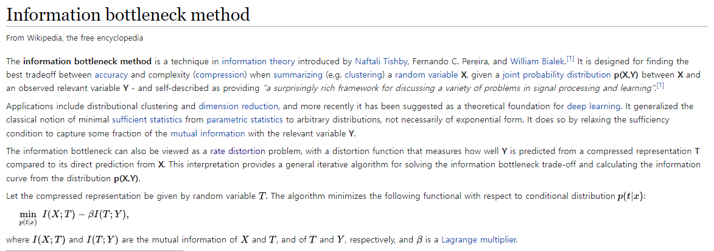

Information bottleneck

balance between **'data fit' & 'generalization'** by using MI (cost function과 regularizer로써)

maximizes :MI (between latency representation & label of the data) -> promote accuracy

minimized : MI(representation & input sample) -> promote generalization 

> *(압축 관련아닌가? 왜 generalization이라 했지?)*

이러한 trade off(relevant information의 보존 & compact한 representation 찾기)는 band-limited한 edge inference에 적합하며, 본 논문의 모델 구조의 메인 디자인 원리가 될 것이다.

### B. Contributions

본 논문에서는 IB 원리에 기반하여 device-edge co-inference기법에서 task-oriented communication을 하기위한 효율적인 방법을 제시할 것이다.

1. 앞서 얘기한 IB framework 이용해서 rate-distortion 이론을 formalizing 할 것이다. wireless edge inference에서 IB가 고려된 첫 번째 논문이다. 
2. IB formulation에 있는 mutual information은 고차원에서 DNN으로 다루기 힘들다. 그래서 **VIB(variational information bottleneck)이라는 variational approximation을 사용할 것**이다. 이를 이용해 MI를 다루기 쉬운 **MI의 upper bound**로 approximation 할 것이다. 게다가 **sparsity-inducing distribution이라는 사전 변형을 이용**함으로써, VIB framework는 **불필요한 encoded feature의 차원을 식별하고 다듬어** 통신의 오버헤드를 줄일 것이다. 이러한 방법을 **VFE(variational feature encoding)**이라 한다.
3. 다이나믹한 채널 컨디션에 따라 가변 길이의 VFE, 즉 **VL-VFE(variable-length variational feature encoding)을 사용할 것**이다.**(채널 컨디션에 따라서 active한 차원을 조절가능**하게 할 수 있는 다이나믹 뉴럴넷으로 구성되어 있다.)
4. image classification이라는 task에서 static&dynamic 채널 컨디션에서 검증할 것이다. 기존 기법들보다 높은 성능을 보였다.

## II. SYSTEM MODEL AND PROBLEM DESCRIPTION

### A. System Model

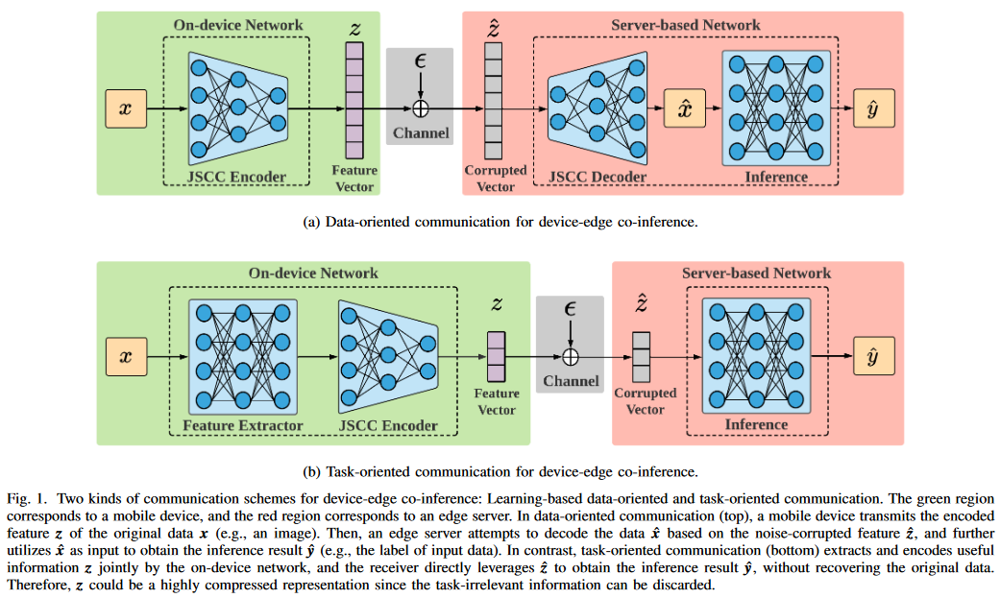

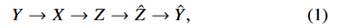

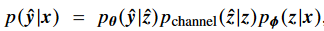

앞단 파라미터 $\phi$  (feature extractor and a JSCC encoder) - on devised net

뒷단 파라미터 $\theta$ (inference) -server based net

scalar Gaussian channel 가정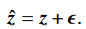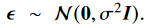

z(feature vector)의 각 차원마다 power constraint함.(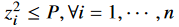,n은 encoded feature vector의 차원)

### B. Problem Description

앞서 얘기한데로, 심볼을 더많은 차원을 이용해 보내게 된다면 높은 퀄리티의 feature vector를 갖게 되고, 높은 accuracy를 얻게 되지만, 오버헤드와 latency가 증가하게 된다. 따라서 inference performance와 overhead의 trade-off를 자연스레 가지게 된다. 이것은 새롭고 특별한 버전의 rate-distortion trade-off 로 볼 수 있다. 그러므로 optimization problem을 공식하기 위해, 우리는 IB원리에 의존하며 다음과 같은 objective function을 최소화 해야한다.

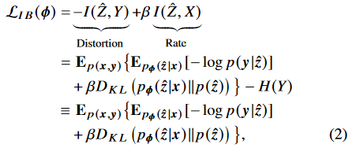

위의 IB objective function은 파리미터$\theta$ 와 unrelated 되어있다. 왜냐하면  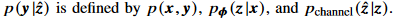이기 때문이다. 직관적으로 생각해봐도 알 수 있다.

그리고 H(Y)는 input data distribution에 관계된 상수항이다. 따라서 objective function에서 무시가능 하다.

Distortion에 해당하는 $I(\hat{Z},Y)$항은$X$가 주어졌을 때 $\hat{Z}$에서의 (최소한의 차원으로) 보존된 정보량임을 알 수 있다.

$-I(\hat{Z},Y)$는  $-H(Y)+H(Y\mid\hat{Z})$ 으로 나타낼 수 있고 H(Y)는 상수이므로, $H(Y\mid\hat{Z})$를 최소화 하면 된다. 이는 Z^이 주어졌을 때, Y의 불확실성(distortion)을 최소화 한다고 생각할 수 있다.

그러므로 IB principle은 rate-distortion tradeoff를 형식화 한다고 할 수 있으며, conditional mutual information인 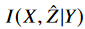(Y가 주어졌을 때 Z^과 X의 mutual information)를 최소화 한다. 는 전송하고자하는 redundant한 정보의 양과 대응된다(얼마나 압축되냐의 관계이지). 

data-oriented communication과 비교해 봤을 때, IB framework는 최대한  task-relevant information을 유지하고, H(X)보다 작은 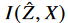을 발생시켜서 통신 오버헤드를 줄인다.

### C. Main Challenges

1. MI 측정방법 : 정확한 확률 분포를 모르는 고차원에서 MI 측정은 매우 어렵다.(왜냐하면 확률 분포의 경험적 추정(empirical estimate)에서는 표본 수가 차원에 따라 기하급수적으로 증가하기 때문에) 그래서 tractable한 MI estimator는 중요한 요소이다.
2. 통신 오버헤드의 효과적인 컨트롤 : input data & feature vector 간의 MI를 최소화하는 것은 task와 상관없는 정보에 관한 redundancy를 줄이는 것이다.(압축) 그러나 redundancy reduction과 feature sparsification(feature 희소화, JSCC로 통신 오버헤드를 제어하는)간의 직접적인 연결은 없다. 그러므로 통신 오버헤드를 줄이기 위한 효과적인 방법으로, 전송할 심볼 수를 최소화 하기위해 방해물(nuisance)들을 확장가능한 차원으로 집계(aggregate)하는 방법이 있다.
3. 다이나믹한 채널 컨디션 :  DNN기반에서는 encoded feature length를 조절하는 것은 쉽지 않다. 보통 하이퍼 파라미터로 정해져 있기 때문이다. 채널 조건에 따라 뉴런의 활성화를 변경하기 위해서 새로운 모듈을 제시한다.

## III. VARIATIONAL FEATURE ENCODING

기존 수식들에서  다음과 같은 고차원 적분때문에 두 분포들을 다루기 힘들었다.

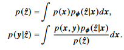

따라서 true distribution인  $p(\hat{z}),p(y\mid \hat{z})$를 approximate하기위해 아래의 $q(\hat{z}),q_{\theta}(y \mid \hat{z})$를 사용한다.

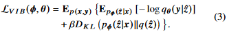

위의 식을 VIB(variational information bottleneck)이라고 부른다. IB objective function(2)의 upper bound이다.  자세한 증명은 appendix A를 참고하자.

또한 reparameterization trick 과 Monte Carlo sampling 을 통해, 우리는 gradient 에 대해서 unbiased된 추정을 할수 있고, 그로인해 objective를 SGD를 통해 optimization 할 수 있다.

$(x_i,y_i)$에 대해  미니 배치 M, 채널 샘플링 L 을 적용하며, 다음과 같이 표현할 수 있다.

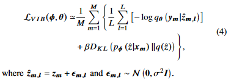

variational inference에 대한 자세한 내용은 다음을 참고하자.

https://ratsgo.github.io/generative%20model/2017/12/19/vi/

### B. Redundancy Reduction and Feature Sparsification

variational approximation 을 통해 인스턴스화된 IB principle를 활용함에 따라, KL-divergence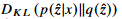를 minimize 하는 것이 feature Z^안의 redundancy를 줄인다고 볼 수 있다.

하지만 이것이 feature encoding 프로세스에서 sparse activations를 보장하지는 않는다.

task-irrelevant한 information를 특정 소모성차원으로 집계하는 feature vector(Z^)를 얻기 위해, log-uniform distribution을 variational  prior로 도입한다. 즉 q(Z^)를 도입하여 sparsity를 유도한다. 

mean-field variational approximation을 사용한다.(계산 복잡도를 완화시키기 위해)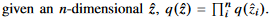

각 $\hat{z_{i}}$는 각 dimension을 의미, variational prior distribution은 다음과 같다.

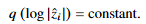

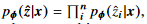이기 때문에 수식(3)의 KL-divergence는 다음과 같이 나타낼 수 있다.

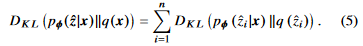

하지만 이것은 closed-form expression이 아니라, 우리는 approximation을 사용한다.[42]

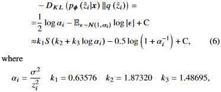

S: sigmoid function

$\alpha_i$가 infinite($z_i$가 0)로 갈 때approximate KL-divergence가 minimum으로 간다. 

섹션 V 에서 empirical results가 보여줄 것이다. 선택된 sparsity-inducing distribution이 z 의 특정 차원들을 sparsifies 하는 것을.(임의의 input에 $z_i\equiv0$, 통신 오버헤드를 줄이는.)

### C. Variational Pruning on Dimension Importance

selected variational prior이 feature vector의 sparsity 를 촉진시키는 동안에, 우리는 어떠한 차원을 축소시킬건지 결정한느 방법에 대해 고안해야된다. 

$z_i\equiv0$ 을 유지 시키는 것은 해당 레이어에서 $z_i$에 해당하는모든 weights 와 bias 들이 0으로 수렴해야 한다. 그러나 모든 파라미터를 체크하는 것은 time-consuming in large-scale DNN이다. 이러한 문제를 해결하기 위해서 각 뉴런의 아웃풋의 중요도를 나타내는 dimension importance vector $\gamma$를 소개한다. 

full connected(FC) layer를 다음과 같이 쓸 수 있다.

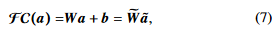

$\tilde{W}=[W,b],\; is\;an\;augmented \;weighted\;matrix$

 $\tilde{a}=[a^T,1]^T,\;is\; augmented\; input\; vector$

$\tilde{W_i}$를 $\tilde{W}$의 i번째 row vector로 정의하자.

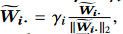

l-2 normalization 한뒤에 $\gamma_i$라는 가중치를 붙여서 augmented weight matrix를 재정의 했다. 

제안된 VFE방법은 input x를 encoded feature z로 매핑시킬때 $z_i$를 다음과 같이 정의한다.

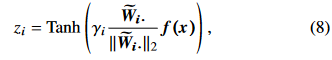

$z_i$: z의 i번째 차원의 값

Tanh : activation function

$f(\bullet)$: 이전 on-device layers에서 정의 된것 

$f(x)$: FC layer의 인풋이다. 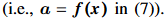

$\gamma$가 0으로 가면, $z_i$도 0으로 가고, 대응되는 $p(\hat{z}\mid x)$도 유효한 정보 없이 채널 노이즈 분포로 degrade된다. 

이러한 아이디어 기반해서  **$\gamma_i$가 threshold $\gamma_0$ 보다 작을 때 redundant 한 채널을 제거**한다. 

 Tanh activation function은 (-1,1)의 범위를 가지고 있기 때문에, peak transmitted power P가 1로 constrained 된다. 

> ??

수식(8)은 convolutional한 layers 로 쉽게 바꿀 수 있다.

이러한 variational pruning process은 제안된 VFE의 주 요소중 하나이다.

VFE의 training procedure는 다음과 같다. 

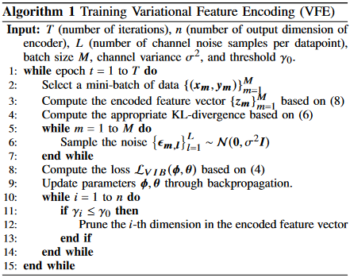

## IV. VARIABLE-LENGTH VARIATIONAL FEATURE ENCODING

그 전에는 static wireless channel로 고려했었음. 하지만 실제에서는 그렇지 않음. low latency inference 를 위한 feature encoding 효율성을 향상시키기 위해 instant한 link adaptation이 필요함.(AMC)  이번 섹션에서는 섹션3의 결과를 확장하고  encoded feature차원을 유동적으로 조절하는 VL-VFE라는 새로운 encoding scheme을 제안 한다.

### A. Background on Dynamic Neural Networks

Dynamic neural networks 의 기존 연구들 소개. 

본 연구에서는 채널 조건에 따라 활성화된 뉴러의 수를 조정할 수 있는 뉴런 세트를 학습하기 위해 다음과 같은 선택적 활성화 아이디어를 사용한다.

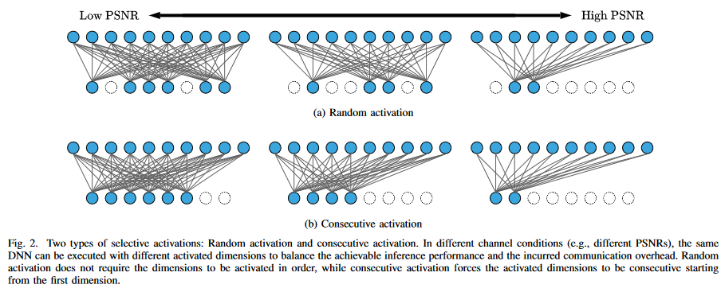

### B. Selective Activation for Dynamic Channel Conditions

다양한 채널 조건에서 출력 길이를 조정할 수 있는 VL-VFE를 제안한다.

채널 적응형 feature encoding schemes는 다음과 같은 속성을 가진다.

1. feature z의 activated된 차원은 DNN forward propagation과정에서 조정될 수 있다. 채널 상태가 좋지 않을 때는 더 많은 치수를 활성화 하고, 좋으면 줄이면 된다.
2. 활성화된 차원은 fig2.b와 같이 consecutive activation을 사용하게 되면, 추가 통신 자원들을 활용하여 활성화된 차원의 인덱스를 전송하는 것을 피할 수 있다.

실제 시스템에서는, mobile device는 채널 컨디션을 피드백을 통해서 얻는다. 그러므로 채널 컨디션은 feature encoding process에 통합될 수 있다. encoded feature vector의 amplitude가 Tanh function에 의해 1로 constrained되 있기 때문에, 노이즈 분산인 $\sigma^2$는 PSNR를 대표하기에 충분하고 feature encoder의 추가 입력으로 채택된다. 

여기서  $\sigma^2$는 다이나믹 채널 컨디션의 범위 안의 분포를 가진 random variable로 간주 된다. 여기서 우리는  $\sigma^2$를 uniform distribution $p(\sigma^2)$에서 sample 한다 생각한다. $p(\sigma^2)$는 데이터 셋과 independent 하다.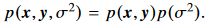

(3)의 Loss function은 다음과 같이 나타낼 수 있다.

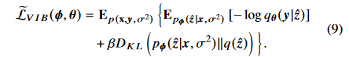

여기서 우리는 식(4)에서 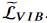를 추정하기 위해 Monte Carlo sampling 를 도입한다.

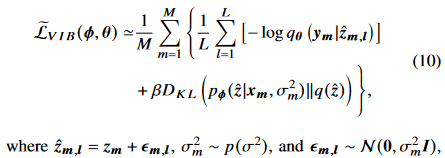

encoding scheme 이 channel-adaptive 해서 우리는 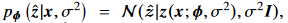을 가진다. where 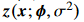는  $\sigma ^2$를 같이input으로 넣은 on-device network에 의해 결정된다. 

그러므로 식(8)은 다음과(11) 같이 수정된다. 

dimension importance $\gamma _i(\sigma ^2)$(= $\gamma(\sigma ^2)$의 i번째 요소)는 channel condition의 함수이다. 

activated 차원을 조절하기위해 다이렉트로 gating network를 train시키기 보다,섹션 3에서 얘기한 intrinsic sparsity(고유 희소성)로 인해 $\gamma (\sigma ^2)$는 redundant차원을 adaptively하게 축소시킬 수 있다. 

결과적으로, device edge co-inference 시스템에서,  $\gamma (\sigma ^2)$의 threshold를 세팅함으로써 encoded feature vecotor의 activated 차원을 쉽게 결정할 수 있다.

게다가 VL-VFE는 consecutive activation 속성을 만족해야되기 때문에, 우리는 특정 그룹 sparsity pattern을 유발하기 위해 $\gamma (\sigma ^2)$를 정의한다. $\gamma _i(\sigma ^2)$는 다음과 같이 구성된다.

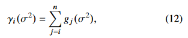

$g_j(\cdot)$ : 함수 $g(\cdot)$ 의 j-th output 차원 ,$g(\cdot)$는 lightweight MLP에 의해 파리미터화됨. 해당 MLP들의 파라미터들의 범위를 constraining함으로써, 각 함수$g_j(\sigma ^2)$들이 non-negative increasing function이 된다. 이것은 다음과 같은 수식들로 이끈다.

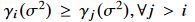and 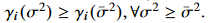

그러므로 threshold 인 $\gamma_0$가 주어졌을때, VL-VFE 방법은 (algorithm 2) 차원을 consecutively 하게 activate할 수 있으며, 불리한 채널 조건일 때 활성화된 차원을 늘릴 수 있다.  MLP구조와 parameter constraints의 자세한 내용은 appendix B를 참고하자.

### C. Training Procedure for the Dynamic Neural Network

다이나믹 뉴럴 넷(다른 채널 컨디션에서 selective activation을 하는)을 train시키기 위해 다른 case들에서 샘플된 losses들을 평균을 낸다. 

각 training iteration에서, 우리는 가능한 PSNR 범위에서 $\sigma ^2$를 샘플링한다. 

알고리즘 1과는 다르게 트레이닝 시킬 때, VL-VFE는 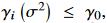에 해당하는 차원을 deactivate 시킨다.( $\gamma (\sigma ^2)$ 는 수렴하기전까지 stable 하지 않기 때문에, 영원히 pruning(가지치기,잘라내다,축소하다) 하는 것이 아니라) .

자세한건 알고리즘2를 참고하자.

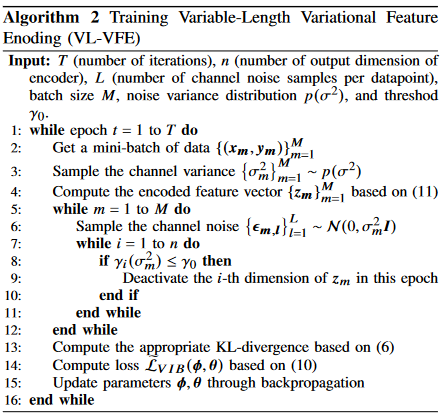

## V. PERFORMANCE EVALUATION

image classification에서 성능 평가, rate-distortion trade-off 조사.

섹션 3에서 논의된 variational prior distribution의 적절한 선택의 중요성을 알리기 위해 ablation study가 수행되었다. 

*ablation study란 좀 더 직관적으로 말씀드리면 제안한 요소가 모델에 어떠한 영향을 미치는지 확인하고 싶을 때, 이 요소를 포함한 모델과 포함하지 않은 모델을 비교하는 것을 말한다. 이는 딥러닝 연구에서 매우 중요한 의미를 지니는데, 시스템의 인과관계(causality)를 간단히 알아볼 수 있기 때문이다.*

###  A. Experimental Setup

#### 1) Datasets

두가지 벤치마크 : MNIST[47] ,CIFAR-10[48]

appendix D : test our proposed methods on the Tiny Imagenet dataset[49]

#### 2) Baselines

proposed methods vs 2 learning-based communication systems for device-edge co-inference (DEEP JSCC, learning based Quantization)

- DeepJSCC : 일반적인 JSCC , loss function: cross-entropy, communication cost: feature encoder의 output 차원의 비율
- Learning-based Quantization : quantizes the floating-point values in the encoded feature vector into low-precision data representations (e.g. , the 2-bit fixed point format).인코딩된 feature vector의 부동 소수점 값을 낮은 정밀도의 데이터 표현으로 양자화 했다는 뜻. lossy source coding 부분과 매치된다고 생각하면됨. 그 다음에 channel coding이 필요한데 finite block-length에서 바뀌는 채널 컨디션에 따라 채널 코딩을 설계하는 것은 어렵다. 따라서 공정한 비교를 위해 adaptive channel coding(communication rate은 다음과 같은) 을 한다고 가정한다.	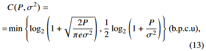

#### 3) Metrics

우리는 task-oriented communication에서 rate-distortion의 trade-off를 고려했다. classification task에서 우리는 classification accuracy를 inference performance로 사용하고, communication latency를 rate의 지표로서 채택했다. 우리는 대역폭을 12.5kHz , symbol rate를 9,600 Baud로 설정했다.

#### 4) Neural Network Architecture

- For MNIST classification

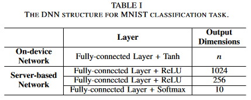

- For the CIFAR-10 classification task

  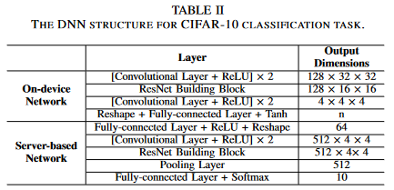

  

proposed methods는 encoded feature vector의 redundant(중복) 차원을 줄일 수 있기 때문에, 다음에 나오는 실험들에서 n을 64 or 128로 초기화 한다. 또한 식 (12)에 있는variable-length coding을 위한 함수 $g(\cdot)$는  각 레이어가 16개의 hidden units로 이뤄진 3-layer MLP로 구성되어 있다. (이는 다른 계산 집약적인 모듈에 비해 무시할 수 있는 계산을 제공한다)

> ??

> computation latency 와 communication overhead의 trade off가 있는데 여기서 **우리는 extreme bandwidth-limited 상황을 가정하여 communication overhead부분을 메인으로 고려**할 것이다.

### B. Results for Static Channel Conditions

