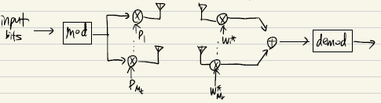
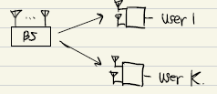
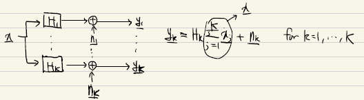
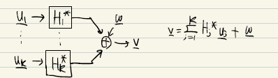
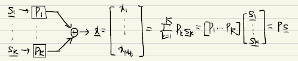
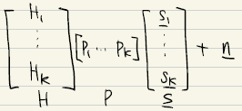

---

2022년 9월 23일 MIMO study

// * : ##

// - : -

----

## Diversity analysis of MIMO SVD systems

- For uncoded systems, the diversity equals $D_{SVD}=(M_t-M_s+1)(M_s-M_t+1)$
- The beamforming case($M_s=1$) achieve full diversity D=$M_tM_r$ with no multiplexing gain
- For thr full SM case of $M_s  = M_r = M_t,$ there is no diversity gain($D=1$)
- open loop MLD $(D=m_r)$

## Alternative derivation for beamforming ($M_s=1$)

- The channel output is given as $\vec{y}=H\,\vec{p}\,s+\vec{n}$ where $\vec{p}=[p_1,p_2,...,p_{M_t}]^T \; with ||\vec{p}||^2 =1$

- By applying the receive filter $ \vec{w} =[w_1,w_2,...,w_{M_r}]^T$ , the recevier filter output becomes $\vec{z}=\vec{w}^*\,\vec{y}=\vec{w}^*H\,\vec{p}\,s+\vec{w}^*\vec{n}$

- For a given P, from the MRC solutuin, the receiver vector $\vec{w}$ is se to  $\vec{w}=H\vec{p}$. Then we have $ \vec{z} =\vec{w}^*H\,\vec{p}\,s+\vec{w}^*\vec{n}= \vec{p}^*H^*H\,\vec{p}\,s+\vec{w}^*\vec{n}=||\vec{w}||^2s+\vec{w}^*\vec{n} $

- The output SNR is equal to 

  $$\begin{align*}\\ SNR =\frac{E[||\vec{w}||^2s]^2}{E[\vec{w}^*\vec{n}\vec{n}^*\vec{w}]}= \frac{||\vec{w}||^4E[|s|^2]}{\vec{w}^*E[\vec{n}\vec{n}^*]\vec{w}}  \\ = \frac{||\vec{w}||^4}{\vec{w}^*E[\vec{n}\vec{n}^*]\vec{w}} \\= \frac{||\vec{w}||^4}{\vec{w}^*(N_0I)\vec{w}} \\ =\frac{||\vec{w}||^2}{N_0} \\ = \frac{1}{N_0}\vec{p}^*H^*H\,\vec{p}\ \end{align*}  $$

- To find $\vec{p}$ which maximizes SNR with $ ||\vec{p}||^2 =1$, we set a Lagrage multiplier as $C=\vec{p}^*A\vec{p}+\lambda(||\vec{p}||^2-1), A=H^*H$

  $\vec{p}$ 에 대해서 C 미분하면 , $2A\vec{p}+2\lambda \vec{p} = 0  \rightarrow A\vec{p}=\lambda' \vec{p} $	

  솔루션은 A의 eigenvector로 나온다. 이것은 $\vec{p}^*A\vec{p}=\lambda'\vec{p}^*\vec{p}=\lambda'$ and the SNR becomes $\frac{\lambda'}{N_0}$

**SNR maximum은 $\frac{\lambda_{max}}{N_o}$을 가지며, $\vec{p}$ 는 $H^*H$의 eigenvector이다(maximum eigenvalue $\lambda_{max}$에 대응되는)**

- Equivalently, $\vec{p}$ equals the right singular vector of H corresponding to the maximum singular value $$\sigma_{max}^2$$
  - $H=U\Sigma V^*$   , $V=\lambda(H^*H)$    , $U=\lambda(HH^*)$ 

## Limited feedback MIMO systems <--> full feedback

- 이상적인 closed loop 시스템에서는,  perfect 한 CSI가 TX,RX 모두 알고있다고 가정한다. TDD에서, channel reciprocity로 실현될 수 있다.
- FDD시스템에서, 딜레이가 없는 reliable feedback channel이 필요하다. 특히 time-varying channels에서 채널 계수의 feedback 오버헤드가 금지될 수 있다.  
- 피드백 오버헤들르 줄이는 유명한 솔루션은 “limited feedback” scheme이다.  limited feedback은 codebook $\Omega$ 를 TX,RX 모두 공유하여 selected codeword의 index만 TX로 다시 보내는 것이다.
- 이것은 모든 채널 계수를 quantized 해서 feedback 하는거에 비교하여 더 효율적이다.
- receiver는 feedback index(시스템 퍼포먼스를 가장 증가시키는, achivable rate, distance form the actual channel) 를 고른다.
- 디자인된 task는 channel matrix의 correlation을 maximize하기 위해, 적절한 codebook $\Omega$를 찾아야 한다.

## Genaralized Lloyd algorithms(성능이 제일 좋게 나옴)

- 코드북 디자인은 chordal distance의 clustering problem으로 볼 수 있다. 
  - 여기서 chrodal distance $d(F_i,\tilde{F}) = ||F_iF_i^*-\tilde{F}\tilde{F}^*||^2_F$ where $\;\tilde{F}$ is arbitary matrix in a particular region
- Generalized Lloyd algorithm은 fading channel에 적용 가능하며 near-optimum performance를 낸다.
-  빔포밍 시스템($M_S=1$)  with  $\vec{y}=H\,\vec{p}\,s+\vec{n}$.   RX는 channel matrix H대신에 빔포밍 벡터 $\vec{p}$를 골라야한다.그리고 이것은 feedback index를 고름으로써 해결할 수 있다. 그러니까 p에 사용할 코드북 인덱스를 피드백하겠다는 뜻. 

## Multi-user MIMO(MU-MIMO)

- MU-MIMO에서 BS는 K유저를 동시에 서폿한다. 각 유저들은 다른유저들의 신호들을 간섭으로써 수신한다. 

- 유저들은 서로 독립적이라고 가정한다(협력하지 못한다), 만약 서로 cooperate 할 수 있다면, MU-MIMO는 하나의 super유저를 가진 SU-MIMO로 될 것이다. 그러므로 SU-MIMO는 MU-MIMO의 upper-bound를 제공한다.

- MU(multi-user) systems 의 기본 구조

   1. MIMO broadcast channels(BC)

      

   2. MIMO multiple access channel(MAC)

      

- Tx가 multiple antenna를 가지고 있을 때 BC(broadcast) 는 일반적으로 non-degraded(순서를 매길 수 없음)이다. 유저들이 그들의 채널의 세기에 대해 랭크되어 질 수 없기 때문이다. BC일때 모든 채널을 통과하는 신호들을 다 받는다는 뜻. 그러므로 superposition coding은 더이상 optimal이 아니다.

- DPC(dirty paper coding)은 1983년에 Costa’s paper에서 처음 소개되었다. 이 논문은 interference를 Tx가 알지 못할 때, DPC를 사용하면 interference는 capacity에서 어떠한 loss도 발생시키지 않는다는 것이다.

- MIMO-BC의 capacity region이 DPC로 인해 달성될 수 있음을 보였다. 

- MAC problem은 더 풀기 쉽다. 그러므로 up-down duality는 BC sum capacity problem을 numerical하게 효울적으로 풀 수 있는 방법을 제공한다.  

- MU MIMO를 위한 Tx 구조

  - 

    where $P_k : M_T$x$M_r$ precoding matrix for user R(R=1,...,K)

    ​			$\vec{s}_k:$ symbol vector of length $M_r$ for user K

    ​			$P =[P_1,P_2,..,P_K] \in \mathbb{C}^{M_t\times kM_R}$

    ​			$\vec{s}=[\vec{s_1^T},\vec{s_2^T},...,\vec{s_k^T}]^T\in \mathbb{C}^{ \,kM_R\times 1 }$

- 수신받은 신호벡터는 다음과 같다. 

  - $$\begin{align*}\vec{y_k}=H_k \vec{x}+\vec{n_k}=H_k\sum\limits_{j=1}^{k}p_j\vec{s}_j+\vec{n}_k\\=H_kP_k\vec{s}_k+H_k\sum\limits_{j\neq k}p_j\vec{s}_j+\vec{n}_k \end {align*}$$

  - stacking up all K vectors, we have

    $\vec{y}$  =   

    = $HP\vec{s}+\vec{n}$

##  Channel inversion(CI)

- CI는 MISO시스템에 right inverse를 precoder로 사용함으로써 적용된다.
  - $ P=\frac{1}{\gamma}H^*(HH^*)^{-1}\, \in \mathbb{C}^{M_t\times k} $  where $\gamma$ 는 power normalization factor이다. 
- 수신된 벡터는 다음과 같다.
- y = 

