# KL-Divergence

기계학습에서는 특정 dataset의 분포를 추정하기 위해 **그 집단을 대표하는 Sample을 뽑아 관찰하는 기법**을 사용한다. 예를 들어 참치와 고등어가 서식하는 바다에서 10마리의 물고기를 잡았을 때 참치 1마리와 9마리의 고등어가 잡혔다면, 우리는 이 바다에 살고 있는 물고기가 대략 참치 10%와 고등어 90%로 이루어져 있다고 짐작할 수 있다. 

그렇다면 우리가 데이터의 분포를 추정했을 때 **얼마나 잘 추정한 것인지** 측정하는 방법은 없을까?

**Kullback-Leibler Divergence** 와 **Jensen-Shannon Divergence**는 **서로 다른 확률 분포의 차이를 즉정하는 척도**입니다. 우리가 **추정한 확률 분포와 실제 확률 분포 사이의 차이가 작다면 좋은 추정**이라고 할 수 있습니다.

또한 기계학습에서는 복잡한 함수나 분포를 단순화 하여 하나의 간단한 함수로 나타내려는 노력을 많이 한다. 예를 들어 실제 측정 결과 얻은 복잡한 확률 분포를 비교적 적은 파라미터를 갖는 Gaussian Distribution 등으로 근사한다면 약간의 오차는 있겠지만 정보를 저장하는 데 드는 비용을 크게 절감할 수 있을 것이다. 이 때도 역시 가장 오차가 적은 Model로 근사하기 위해 위와 같은 척도들을 이용한다. 두 확률 분포 간의 차이를 나타내는 척도인 **Kullback-Leibler Divergence** 와 **Jensen-Shannon Divergence**에 대하여 알아보도록 하겠다.

예를 들어 각 알파벳 **a, b, c, d, e**  가 있고, 각 알파벳이 뽑힐 확률은 다음과 같다고 하자.

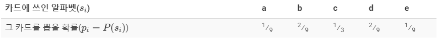

확률 분포로 나타내면 다음과 같다.

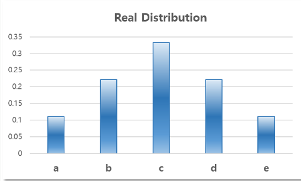

하지만 이와 같이 표로 나타내는 것은 정보를 **저장하는데 많은 용량이 필요**하며 **수학적으로 다루기가 까다롭다**. 그렇기 때문에 우리는 위 확률 분포를 많이 쓰이는 확률 분포 모델로 **근사**하기로 하자.

- Uniform Distribution으로 근사한다고 생각해보자

  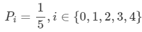

  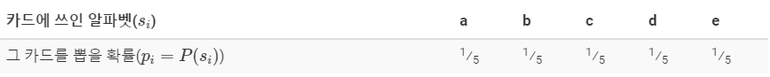

  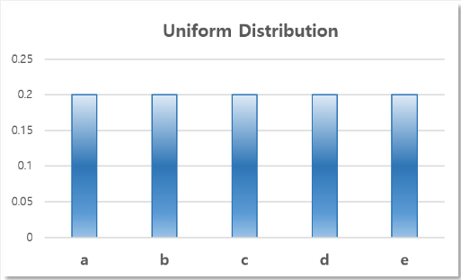

- Binomial Distribution으로 근사한다고 생각해보자.

  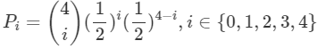

  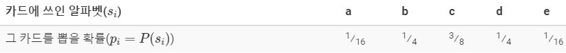

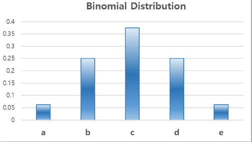

우리에게는 카드가 나올 확률을 표현할만한 두 가지 모델이 존재한다. 그렇다면 어떤 모델이 실제 확률 분포를 **더 잘 표현**할까? 즉, 어떤 모델이 실제 확률 분포와 **더 닮았을까**? 우리는 해당 모델이 실제 모델과 얼마나 닮았는지 알기 위한 **정량적인 척도**가 필요하다. 이러한 척도중 하나가 바로 **Kullback-Leibler Divergence(KL-Divergence)**이다. 

**Kullback-Leibler Divergence**는 앞에서 살펴봤듯이 두 모델이 얼마나 비슷하게 생겼는지를 알기 위한 척도인데, 제시한 모델이 실제 모델의 각 item들의 **정보량**을 얼마나 잘 보존하는지를 측정한다. 즉, 원본 데이터가 가지고 있는 **정보량을 잘 보존**할 수록 **원본 데이터와 비슷한 모델**이라는 것이다. 먼저 item $s_i$가 갖는 정보량은 다음과 같이 계산하였다.

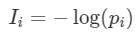

리고 원본 확률 분포 $p$ 와 근사된 분포 $q$에 대하여 i번째 item이 가진 정보량의 차이(정보 손실량)는 다음과 같을 것이다.

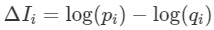

$p$에 대하여 이러한 **정보 손실량의 기댓값**을 구한 것이 바로 KL-Divergence이다.

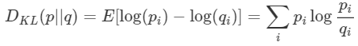

간단히 말하면, KL-Divergence는 **근사시 발생하는 정보 손실량의 기댓값**이다. 이 값이 작을 수록 더 가깝게 근사한 것이라고 할 수 있다. 그러면 이제 위 두 모델중에 어떤 모델이 원본과 더 가까운지 측정해보도록 하자.

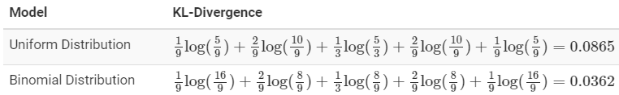

계산 결과, **Binomial Distribution**으로 근사하는 것이 더 효과적이라는 결론을 얻을 수 있다.

## Jensen-Shannon Divergence

당연하게도, KL-Divergence는 근사된 확률 분포가 얼마나 원본과 비슷한지를 측정하는 척도 이외에도, 단순히 **두 대등한 확률 분포가 얼마나 닮았는지**를 측정하는 척도로 쓰일 수 있다. 하지만 포스트를 읽으면서 눈치 채신 분들도 있겠지만, **KL-Divergence는 Symmetric하지 않다**. 즉 $D_{KL}(p\mid \mid q)\neq D_{KL}(q\mid \mid p)$이다. 그렇기 때문에 KL-Divergence를 Symmetric하게끔 개량한 **Jensen-Shannon Divergence**를 쓴다.

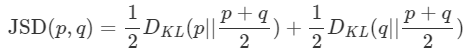

러면 $JSD(p,q)=JSD(q,p)$가 되어, 두 확률 분포 사이의 **distance**로서의 역할을 할 수 있게 된다.
