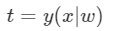
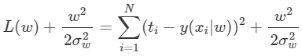

# MLE(Maximum Likelihood Estimation)&MAP  (Maximum A Posterior)

## Bayes’ Rule

어떤 값을 예측하기 위한 수단, 딥러닝 이전 부터 많이 쓰여왔던 방식이다.

낚시를 통해 건져 올린 물고고기의 피부 밝기 정보를 이용해서 그 물고기가 농어인지 연어인지 맞추는 Task를 진행한다고 가정하자.

### 수식적 표현

 수학적으로 모델링 할 것이다.

$x$ : 주어진 물고기 피부색 밝기

$w$ : 물고기의 종류

$w=w_1$ : 물고기가 농어일 사건

$w=w_2$ : 물고기가  연어일 사건

물고기의 피부 밝기가 0.5(x) 일때 그 물고기가 농어(w1)일 확률은 다음과 같은 조건부 확률로 표현가능하다.

우리에게 모든 $P(w_1\mid x)$와 $P(w_2\mid x)$가 주어진다면, 어떤 x 가 주어지더라도 다음과 같은 방법을 통해 농어vs연어를 판단할 수 있다.

즉, 물고기 분류 문제는 어떤 x가 주어졌을때 $P(w_i \mid x)$(물고기가 class w_i에 속할 확률)의 값만 알 수 있다면 풀 수 있다. 여기서 우리가 구해야 하는 확률$P(w_i \mid x)$를 **Posterior(사후 확률)** 이라고 부른다. 

### 관찰하기 

어떻게 Posterior($P(w_i \mid x)$)를 구할 수 있을까. 직접 구할 방법은 없어 보인다.

하지만 $P(x \mid w_i )$는 구할 수 있다. 

$P(x \mid w_i )$ : 물고기 종류가 $x_i$일 경우 피부 밝기가 x일 확률, 즉

*$x$는 continuous하기 때문에 확률 보다는 확률밀도가 맞는 표현이다.*

$P(x \mid w_1 )$ : 농어의 피부 밝기 분포

$P(x \mid w_2 )$ : 연어의 피부 밝기 분포

위의 분포들$P(x \mid w_i )$은 관찰을 통해 알 수 있다. 이렇게 관찰을 통해 얻은 확률분포 $P(x \mid w_i )$를 **Likelihood(가능도)** 라고 부른다. 

관찰 측정을 한 결과, 다음과 같은 분포를 얻었다고 가정하자.

이렇게 우리는 Likelihood를 얻었다.

likelihood분포에서 두 곡선이 만나는 지점의 x기준으로 x가 그 값보다 작으면 연어, 크면 농어로 분류하면 되지 않나? 그렇게 하면 Posterior 안구하고 Likelihood만을 가지고 분류할 수 있지 않나? 라는 생각이 들기 마련이다.

하지만 그렇지 않다. 왜냐하면 **Likelihood에는 애초에 연어와 농어가 잡힐 확률이 반영돼 있지 않기 때문**이다. 즉 Liklihood만으로 분류를 하기 위해서는 농어와 연어가 똑같은 비율로 바다에 살고 있다는 가정이 있어야 한다. 

예를 들어, x(밝기) =5가 나왔다고 하자. 그래프 대로라면 우리는 농어로 판단해야한다. 하지만 만약 농어가 희귀해서 잡힐 확률이 1%도 안된다면, 아무리 x=5라고 해도 그 물고기가 농어일 확률은 현저히 낮다.

### 정리

지금까지 우리는 세 가지 종류의 확률을 알아봤다. 정리해보자

- **Posterior($P(w_i \mid x)$):** 피부 밝기($x$)가 주어졌을 때 그 몰고기가 농어 또는 연어일 확률. 

  **즉 단서가 주어졌을 때, 대상이 특정 클래스에 속할 확률. 우리가 최종적으로 구해야 하는 값**이다.

- **Likelihood($P(x\mid w_i)$):** 농어 또는 연어의 피부 밝기(x)가 어느 정도로 분포되어 있는지의 정보. 

  즉, **각 클래스에서 우리가 활용할 단서가 어떤 형태로 분포** 돼 있는지를 알려준다. Posterior를 구하는 데 있어서 매우 중요한 단서가 된다. 

- **Prior($P(w_i)$):** 피부 밝기($x$)에 관계 없이 농어와 연어의 비율이 얼마나 되는지의 값. 

  **보통 사전 정보로 주어지거나, 주어지지 않는다면 연구자의 사전 지식을 통해 정해줘야 하는 값**이다.

우리의 목적은 **Posterior($P(w_i \mid x)$)**를 구하는 것이다.

이 값은 **Likelihood($P(x\mid w_i)$) 와 Prior($P(w_i)$) 를 이용**하면 구할 수 있다. 

 $P(w_i \mid x)$ : 구하고자 하는 Posterior

우변의 분자, Likelihood($P(x\mid w_i)$) $\times $ Prior($P(w_i)$)

우변의 분모, **Evidence**라고도 불림, ,이 또한 likelihood 와 Prior들로 구할 수 있다.

즉, 우리는 위의 식을 이용하면 Posterior를 구할 수 있고. 이 식을 **Bayes’ Rule**또는 **Bayesian Equation** 등으로 부른다.

위 그래프는 방금 알아 본 **Bayes’ Rule**에 따라 농어와 연어의 **Posterior**를 구한 결과이다. 이제 우리는 $x$가 주어지면 **Posterior**가 큰 쪽을 고르면 된다.

농어와 연어를 구분하는 $x$의 전환점을 살펴보면 알겠지만, **Likelihood** 그래프에서는 전환점이 $x=4.5$ 부근에 형성되지만 **Posterior** 그래프에서는 $x=3$ 부근에 형성된다. 연어가 더 희귀하다는 사전 정보(**Prior**)가 반영되었기 때문이다.

하지만 이런 **Bayes Rule**의 가장 큰 단점들 중 하나는 Likelihood의 Probability Distribution을 알아야 한다는 점이다. 물론 관찰을 통해 얻을 순 있지만 , 오래 걸리고,완벽한 Distribution을 얻기란 사실상 불가능에 가깝다.

그래서 Data로부터 직접 decision policy를 얻고자 한다. 정해지지 않은 몇 개의 parameter로 이루어진 함수로 모델링을 한 후에, 이 모델이 주어진 **Data를 가장 잘 설명하도록 parameter들을 구해**낼 수 있다면 어떨까? 

이러한 방식을 이용하는 대표적인 알고리즘이 바로 **Deep Learning**이다. 그리고 이 Deep Learning의 기본적인 Loss Function들은 대부분 **Maximum Likelihood Estimation(MLE)**과 **Maximum A Posterior(MAP)**를 통해 증명된다. 

## MLE&MAP

### 문제 정의

키를 보고 몸무게를 예측하는 regression 문제를 생각하자.

 

Dataset(D) : N명의 키($x_i$),몸무게($t_i$)	를 가지고 있다고 생각하자.

우리는 parameter $w$를 갖고 키($x$)를 넣으면 예측된 몸무게 ($y$)가 나오는 함수 $y(x\mid w)$를 정의하여, 가능한 모든 키($x$)에 대하여 예측된 몸무게 $y(x\mid w)$가 실제 몸무게 $t$에 가깝게 나오도록 $w$ 를 정해줘야 한다. 

여기서 $w$는 $y(x\mid w)$가 갖는 **parameter**로, 일차함수 ($y=ax+b$)의 예를 들면 $a$와$b$와 같은 계수를 의미한다. 

parameter는 하나의 값일 수도 있고 여러 개의 값일 수도 있으며, 벡터일 수도 행렬일 수도 있다. 이러한 역할을 하는 parameter를 싸잡아서 **w**로 표현한 것이다. 이러게 parameter들을 잘 학습하여 완벽한 모델 $y(x\mid w)$를 얻고 나면 우리는 모든 가능한 키 ($x$)에 대하여 실제 몸무게($t$)를 알고 싶다면 다음 식을 이용하면 된다고 말할 수 있다.

그렇다면 우리는 항상 $t=y(x|w)$라고 말할 수 있을까? 아니다. 예측을 할 때는 겸손해야 한다. 즉 **“실제 몸무게($t$)는 내가 예측한 몸무게($y$)과 정확히 일치한다!”**라는 말은 실로 건방진 말이 아닐 수 없다. **“실제 몸무게($t$)는 내가 예측한 몸무게($y$)일 확률이 가장 높지만, 아닐 수도 있어!”**정도는 해 줘야 현명한 대답이 될 것이다. 여기서 **“아닐 수도 있다!”**의 의미는 우리의 예측 실력이 부족하기 때문이 아니다. 바로 **데이터의 형태** 때문이다. 예를 들어 보자. 키가 175cm인 사람 중에는 몸무게가 70kg인 사람도 있지만, 몸무게가 69kg인 사람도, 71kg인 사람도 충분히 존재한다. 우리는 애초에 $x=175$라는 input에 대해서 실제 몸무게($t$)를 **100% 완벽하게 예측할 수 없다.** 즉 우리가 예측하는 능력이 부족해서가 아니라, **근본적으로 발생하는 불확실성**이라고 볼 수 있다.

그러면 이 말을 조금 더 수학적인 표현을 섞어 하면 어떻게 될까? **“실제 몸무게는($t$)는 우리가 모르기 때문에 Random Variable인데, 그림1과 같이 내가 예측한 몸무게($y$)를 평균으로 하는 Gaussian 분포를 따른다고 볼 수 있다!”**이렇게 말하면 앞에서 한 말과 비슷한 의미를 전달할 수 있게 된다. **Gaussian 분포는 평균에서 확률 밀도가 가장 높기 때문**이다.

이를 조금 더 수학적인 표현을 이용해서 말하면 **“실제 몸무게($t$)는 내가 예측한 몸무게($y$)를 평균으로 하고 특정 값 $\sigma$를 표준편차로 하는 Gaussian Distribution을 따른다”**고 할 수 있고, 다음과 같이 쓸 수 있다.

여기서 $\sigma$는 무엇을 의미할까? 우리가 Gaussian Distribution을 이용하는 이유는 자신이 한 예측을 **100% 확신할 수 없기 때문**이라고 했다. 그래서 **그림1**과 같은 형태로 대답하게 된 것인데, **그림1**에서 Distribution의 폭이 작다는 것($\sigma$가 작다는 것)은 무엇을 의미할까? 바로 우리가 예측한 값에 더 확신한다는 뜻이다. 반대로 폭이 크다는 것($\sigma$가 크다는 것)은 그 만큼 우리가 예측한 값에 자신이 없다는 뜻이다. 즉 $\sigma$는 **우리가 한 예측이 얼마나 불확실한지의 정도**를 나타낸다. 하지만 앞에서도 말했듯이 $\sigma$는 우리의 **예측 능력에 따른 변수가 아니다.** 우리가 풀려는 **문제의 특성에 따라 설정되는 값**이다. 우리가 풀려는 문제가 각 $x$에 대해서 $t$값이 대부분 하나로 일정하게 나오는 문제라면 $\sigma$는 작을 것이고, 위에서 설명한 몸무게 예측 문제처럼 $x$가 같더라도 다양한 $t$가 나올 수 있는 문제라면 $\sigma$는 클 것이다. 즉 우리가 문제의 특성을 파악하고 설정해주는 **상수** 값이다.

### Maximum Likelihood Estimation

$\sigma$와 $w$는 parameter이므로 좌변의 notation에서 생략하였다. 

여기서 $p(t\mid x)$가 의미하는 바는 무엇인가? 바로 input인 키가 $x$일 때 실제 몸무게가 $t$일 확률(밀도)이다. 변수가 continuous하기 때문에 확률 밀도라고 부르는 것이므로 편의상 확률이라고 하자. 이제 앞에서 학습을 위해 가지고 있던 Dataset을 다시 보도록 하자.

$p(t\mid x)$의 의미는 **키가 $x$일 때 실제 몸무게가 $t$일 확률**이라고 하였는데, 그렇다면 Dataset이 위와 같이 구성될 확률($p(D)$)은 어떻게 구하면 될까? Dataset이 위와 같이 구성될 확률은 다시 말하면 **“키가 $x_1$일 때 실제 몸무게가 $t_1$이고, 키가 $x_2$일 때 실제 몸무게가 $t_2$이고, ⋯⋯, 키가 $x_N$일 때 실제 몸무게가 $t_N$일 확률”**을 구하고 싶은 것인데, 각 data가 독립이라고 하였을 때, 곱의 법칙을 통해 다음과 같이 구할 수 있게 된다.

사실 그런데 이러한 $p(D)$ 값은 $w$에 따라 다르게 구해진다. 즉 **“키가 $x_1$일 때 실제 몸무게가 $t_1$이고, 키가 $x_2$일 때 실제 몸무게가 $t_2$이고, ⋯⋯, 키가 $x_N$일 때 실제 몸무게가 $t_N$일 확률”**은 $w$에 따라 바뀔 수 있다. 그래서 $p(D)$ 보다는 $p(D|w)$라고 하자. 자, 그럼 이 상황에서 어떤 $w$를 구해야 가장 잘 예측하는 모델이 될까? 

몸무게를 가장 잘 예측하는 모델은 다음과 같아야 할 것이다.

**“키가 $x_1$일 때에는 실제 몸무게가 $t_1$일 확률이 가장 높다고 말하고, 키가 $x_2$일 때에는 실제 몸무게가 $t_2$일 확률이 가장 높다고 말하고, ⋯⋯, 키가 $x_N$일 때에는 실제 몸무게가 $t_N$일 확률이 가장 높다고 말하는 모델”**

다시 말하면$p(D\mid w)$가 가장 높다고 대답하는 모델, 즉 **$p(D\mid w)$가 최대가 되는 모델**이어야 한다.

결국 우리가 해야 할 일은 **$p(D\mid w)$가 최대가 되는 $w$를 찾는 것**이고, 여기서 $p(D\mid w)$가 바로 **likelihood**기 때문에 이 방식의 이름이 **Maximum Likelihood Estimation**이다.

$p(D\mid w)$를 왜 likelihood라고 부를까?

앞서서, Prior, Likelihood, Posterior에 대해 다뤘다. 이 3개를 구분하려면 우리가 **확률 또는 확률분포를 구하고자 하는 대상을 선택**해야 한다. 앞선 예시에서는 그 대상이 농어($w_1$) 인지 연어($w_2$)인지 여부였다. 

일반적인 **MLE, MAP**를 포함하여 **Deep Learning**까지 대부분의 Machine Learning 알고리즘들이 구하고자 하는 대상은 바로 **모델의 parameter**인 $w$이다.

**구하고자 하는 대상** 다음으로 중요한 것이 바로 **주어진 대상**이다. 이전 포스트에서는 농어와 연어의 피부 밝기(xx)에 대한 정보가 주어졌다. 이번 포스트에서, 그리고 역시나 대부분의 Machine Learning 알고리즘들에게 주어진 대상은 당연히 Dataset, 즉 DD가 된다. 이 두 개념을 이용하여 **Prior, Likelihood, Posterior**의 일반적인 의미를 파악해 보면 다음과 같다.

- **Posterior:** 주어진 대상이 주어졌을 경우, 구하고자 하는 대상의 확률 분포. 이 포스트에서는 $p(w\mid D)$.
- **Likelihood:** 구하고자 하는 대상을 모르지만 안다고 가정했을 경우, 주어진 대상의 분포. 이 포스트에서는 $p(D\mid w)$. $w$를 모르기 때문에 $w$에 대한 함수 형태로 나올 것이다.
- **Prior:** 주어진 대상들과 무관하게, 상식을 통해 우리가 구하고자 하는 대상에 대해 이미 알고 있는 사전 정보. 연구자의 경험을 통해 정해주어야 한다. 이 포스트에서는 $p(w)$.

### MLE의 계산

이제 다시 Maximum Likelihood Estimation으로 돌아가서 수식 전개를 해보도록 하자. Maximum Likelihood Estimation에서 우리가 해야 할 일은 바로 다음 식을 최대로 하는 $w$를 찾는 일이었다.

이런 문제에서 우리는 주로 $log$를 취해 준다. 많은 이유가 있지만 대표적으로는 두 가지 이유 때문이다. 먼저 likelihood가 최대면 likelihood의 $log$ 값도 최대기 때문에 $log$를 취해줘도 문제가 발생하지 않고, 또한 복잡한 곱셈 연산을 덧셈 연산으로 바꿔주기 때문에 수식의 전개가 용이하다. 다음과 같이 전개가 가능하다.

이제 이 log likelihood를 최대가 되게 하는 $w$를 찾아주면 되는데, 알다시피 위 식의 $\sigma$와$\pi$는 상수 값이다. 그렇기 때문에 log likelihood를 최대화시키는 $w$에 영향을 주지 않는다. 그래서 관련된 term들을 전부 제거하면 다음 식이 남게 된다.

예측값과 실제 값의 차이의 제곱. L2 Loss이다. 일반적으로 Deep Learning에서 Regression 시에 가장 많이 쓰는 Loss 함수가 튀어나왔다. 이렇게 **MLE**를 이용하면 Regression에서 L2 Loss를 쓰는 이유를 증명해 낼 수 있다. 반대로, 우리가 앞으로 Deep Learning 등에서 **L2 Loss를 이용한다는 것은 주어진 Data로부터 얻은 Likelihood를 최대화시키겠다는 뜻으로 해석**할 수 있다. **L2 Loss를 최소화 시키는 일은 Likelihood를 최대화 시키는 일**인 것이다. 참고로 **Classification** 문제에서는 **Bernoulli Distribution**을 이용하면 비슷한 방법으로 **Cross Entropy Error**를 유도할 수 있다.

### Maximum A Posterior

**Maximum Likelihood Estimation**이 **Likelihood**를 최대화 시키는 작업이었다면, **Maximum A Posterior**는 이름 그대로 **Posterior**를 최대화 시키는 작업이다. **Likelihood**와 **Posterior**의 차이는 위에서 다뤘듯이, **Prior**의 유무이다. **Posterior**는 **Likelihood**와 다르게 우리의 사전 지식인 **Prior**가 포함되어 있다. 즉 구하고자 하는 대상을 **철저히 데이터만을 이용해서 구하고 싶다면 MLE**를 이용하는 것이고, **데이터와 더불어 우리가 갖고 있는 사전 지식까지 반영하고 싶다면 MAP**를 이용하는 것이다.

그렇다면 **Prior**를 반영해서 좋은 점은 무엇일까? 물론 우리가 **매우 강력한 사전 지식**을 갖고 있다면 $w$값을 구하는 데 있어서 매우 큰 도움이 될 것이다. 하지만 우리에게 별다른 사전 지식이 없더라도 **Prior**를 반영하는 것은 좋은 경우가 많다. output을 우리가 원하는 대로 제어할 수 있기 때문이다. 예를 들어 우리가 모델링한 함수 $y(x\mid w)$가 키($x$)를 줬을 때 몸무게($t$)를 잘 맞추게만 하고 싶으면 **MLE**를 써도 상관 없지만 잘 맞춤과 동시에 $y(x\mid w)$의 parameter $w$의 절댓값이 작기를 원한다면, 즉 0 주변에 분포해 있기를 원한다면 $w$가 0 주변에 분포한다는 **Prior**를 넣어 주어야 한다. 이렇게 **output에 대한 특정 제약조건**을 걸고 싶은 경우에 **MAP**를 쓰는 것이 좋다.

**Posterior**를 Maximize해야 하는 이유는 Likelihood의 경우보다 단순하다. Posterior는 애초에 $w$의 확률 분포기 때문에 $w$가 될 확률이 가장 높은 값으로 정해주는 것이다. 그렇다면 본격적으로 **Posterior**를 구해서 Maximize 해보도록 하자. 앞선 Bayes’ Rule에 따르면 **Posterior**는 다음과 같이 구할 수 있다.

분모가 integral 식으로 바뀐 이유는 $w$가 continuous하기 때문이다. 하지만 겁먹을 것 없는 게, $w$에 대해서는 적분을 하고 있고, $D$는 주어진 값이기 때문에 결국 $\int P(D\mid w)P(w)dw$는 상수가 되어 $\eta$로 치환 가능하다. 기왕 치환하는거 $\eta=\frac{1}{\int P(D\mid w)P(w)dw}$로 치환하자.

그러면 이제 $w$의 Prior를 정해주어야 하는데, 위에서 말했던 것 처럼, $w$에 대한 특별한 사전 지식은 갖고 있지 않은 상황이다. 그러므로 우리 나름대로의 제약조건을 걸어주도록 하자. 

Deep Learning에서 Overfitting을 방지하기 위해 사용하는 방법들 중에 **Weight Decay(Regularization)**라는 방식이 있다. Loss에 $w^2$ 또는 $\vert w \vert $ 등을 추가하여 $w$ 자체의 크기를 줄여 네트워크의 표현력을 감소시키는 방식인데, 이 방식을 우리는 **MAP**를 이용해 유도할 것이다. 우리의 목표는 다음과 같다.

**“Overfitting을 방지하기 위해서는 네트워크의 표현력을 감소시켜야 하는데, 그러기 위해서는 $w$의 절댓값이 작아야 한다. 즉 0 주변에 분포하여야 한다.”**

$w$의 크기를 줄이는 방식에는 여러 가지가 있겠지만, 우리는 $w$에 **Prior**를 걸어 줄 것이다. $w$에 0을 평균으로 하는 Gaussian Distribution이라는 Prior를 걸어주게 되면, $w$는 자연스럽게 0 주변에 배치 될 것이다.

먼저 likelihood에서와 같이 Posterior에 $log$를 취해주도록 하자. 그리고 그 값을 최대로 하는 $w$를 찾는 것이 우리의 목표이다.

여기서 $log\,p(D\mid w)$는 Likelihood 이므로 이 값을 Maximize하는 것은 위에서 봤듯이 $\Sigma _{i=1}^{N}(t_i−y(x_i\mid w))^2$를 Minimize 하는 것과 같다. 길기 때문에 $L(w)=\Sigma _{i=1}^{N}(t_i−y(x_i\mid w))^2$라고 치환하여 대입하면 다음과 같다.

이제 $log\, p(w)$ 을 대입하면 다음과 같다.

$\eta, \pi,\sigma_w$는 전부 상수이므로 관련된 term들을 제거해주면 다음 식을 Minimize하는 문제가 된다.

$\frac{1}{2\sigma_w^2}$는 상수이므로 $\alpha$ 등으로 치환하면 **Weight Decay(L2 Regularization)** 방식을 적용한 Deep Learning의 Loss 함수가 된다. 우리는 Gaussian Distribution을 Prior로 준 문제의 **MAP**로부터 Weight Decay 식을 유도해 낸 것이다. 또한 우리가 앞으로 Deep Learning 등에서 Weight Decay, 그 중에서도 L2 Regularization을 쓴다는 것은 주어진 Data를 적용함과 동시에 $w$에 Gaussian Distribution이라는 Prior를 걸어 주어 **MAP**를 통해 $w$를 구하겠다는 것으로 해석할 수 있다. **L2 Regularization을 적용하는 일은 $w$에 Gaussian Distribution을 Prior로 걸어 주는 일**인 것이다. 참고로 Laplacian Distribution을 Prior로 걸어 주면 L1 Regularization을 얻을 수 있다. 직접 해보기 어렵지 않을 것이다.

