# Variational inference

## Variational Inference 배경

 [사전지식],**MLE**& **MAP**

 **MLE**는 Likelihood만 주어진 경우 이를 최대로 하는 parameter를 찾는 일이고 **MAP**는 Likelihood와 사전 지식인 Prior가 전부 주어진 경우 Posterior를 최대로 하는 parameter를 찾는 일이었습니다.

 하지만 이런 방식으로 **parameter** $w$를 구하는 일은 아직 **Bayesian View**라고 할 수 없습니다.

 **$w$의 분포를 구하는 게 아니라 $w$의 값을 확정짓는 방법들이기 때문**입니다. 우리가 알고자 하는 **Bayesian View**는 구하고자 하는 값인 $w$의 확률 분포, 즉 **posterior**입니다. MAP에서 구하지 않냐구요? MAP에서조차 posterior를 최대로 하는 $w$를 구할 뿐 posterior를 정확히 구하지는 않습니다. 이번 포스팅을 시작으로 $w$의 분포, 즉 **posterior**를 구함으로 인해 진정한 Bayesian View에 접근해 나가도록 하겠습니다.

### Posterior의 장애물 1: Evidence

우리의 목표는 Neural Network의 parameter인 $w$를 찾는 것이다. 하지만 그냥 찾는 것은 쉽다. Loss를 설정해주고 Gradient Descent 알고리즘을 돌리면 되기 때문이다. 이 걸 **Frequentest View**라고 했었다. 우리는 $w$의 값만 알고 싶은 것이 아니라 $w$의 분포, 즉 Posterior를 알고 싶다. 이 걸 **Bayesian View**라고 했었다. 그러면 Posterior를 구하기 위해 Bayesian Equation을 적어보도록 하자.

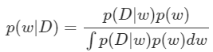

먼저 우리가 구하고자 하는 **Posterior** $p(w\mid D)$는 Train Data D가 주어졌을 때 이를 가장 잘 재현하기 위한 parameter $w$가 있을 텐데, 이 값을 정확히 뭐라고 확정 짓지 않고 확률 분포로 대답한 결과라고 했었다. 이 Posterior는 우리가 구해야 할 값이기도 하다. 

다음은 **Likelihood** $p(D\mid w)$이다. 이 분포는 MLE&MAP 포스터에서 살펴 봤듯이 보통 Gaussian으로 가정한다. 

그 옆에는 **Prior** $p(w)$가 있는데, 이 분포는 우리의 사전 지식에 의해 설정되는 분포다. 사전 지식이 없다면 Prior를 설정해줌으로 인해 우리가 원하는 방향의 $w$가 구해지게끔 할 수도 있다.

이렇게 보면 우리가 중요하게 다뤘던 모든 조건들은 전부 주어지거나 우리가 설정할 수 있다. 그런데도 불구하고 Posterior를 구하지 못하는 이유는 뭘까? 뜬금없게도 분모에 있는 $p(D)=\int p(D\mid w)p(w)p(D)$ 때문이다. 이 값은 **Evidence**라고 부르는데, 이전에도 살펴 봤듯이 상수 값이기 때문에, Posterior를 최대로 하는 $w$만 구하면 됐었던 MAP에서는 따로 구하지 않았었다. 하지만 Posterior 분포를 정확히 알고 싶은 지금은 **꼼짝 없이 구해야 하는 값**이 되어 버렸다. 구하면 되지 않을까? 알다시피 $w$는 이렇게 변수 하나로 적어 놔서 그렇지, 보통 **굉장히 차원이 높은 편**이고 Neural Net의 Layer가 깊어질 수록 그 **개수 또한 어마어마하게 많아**진다. 이렇게 넓은 차원에 퍼져 있는 모든 가능한 $w$에 대하여 적분 연산을 한다는 것은 **사실상 불가능**에 가깝다.

### Posterior의 장애물 2: Output

어찌어찌 위의 문제가 잘 해결되어 $w$의 Posterior $p(w\mid D )$를 구해 냈다고 치자. **MAP**에서는 **Posterior가 최대가 되는 $w$ 값**을 구해서 이 $w$로 이루어 진 Neural Network를 통과시켜, 그대로 Output을 얻기만 하면 됐었다. 하지만 Posterior를 정확히 알고 있는 지금, MAP에서 처럼 Posterior가 최대가 되는 $w$를 찾아 쓰기만 하면 될까? 이럴 거였으면 고생해가면서 Posterior를 구할 이유도 없었다. **MAP**랑 다를 것이 없기 때문이다. Posterior를 온전히 알고 있으면 우리는 **$w$에 따른 Output의 기댓값**을 구할 수 있게 된다. MAP에 비해 Posterior 전체에 담긴 정보를 훨씬 많이 반영한 결과이기 때문에 더 신뢰할 수 있는 output이라고 할 수 있다. 그리고 output의 기댓값은 다음 식을 통해 구할 수 있다.

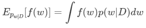

눈치 채셨겠지만, **또 적분**이다. 그것도 그냥 적분이 아니라 위에서 말한 것 처럼 매우 고차원에다가 개수까지 많은 $w$에 대한 적분이다. 이 적분 역시 현실적으로 계산하는 것이 **불가능**하다.

## Variational Inference

위에서 살펴봤듯이, posterior $p(w\mid D)$를 직접 구하기는 힘들어 보인다. 그럼 간접적인 방법에는 어떤 것이 있을까? Deep Learning의 중요한 본질들 중 하나는 바로 **우리가 모르는 함수 $f$가 있을 때, 비교적 적은 미지수를 갖고 우리가 아는 함수$g$를 정의하여 $g$가 $f$를 잘 흉내내도록 미지수들을 정해주는것**이다. 우리는 똑같은 논리를 이 곳에 적용시킬 것이다. 즉 우리가 알고 비교적 적은 parameter $\theta$를 갖는 분포$ q(w\mid \theta)$를 정의하여 이 $q(w\mid \theta)$가 $p(w\mid D)$를 가장 **잘 흉내내도록** $ q(w\mid \theta)$의 parameter $\theta$를 정해주는 것이다. 다만 이 둘은 함수가 아니기 때문에 기존의 Deep Learning에서 쓰는 방법과는 다른 접근이 필요하다.

먼저 $q(w\mid \theta)$가 $p(w\mid D)$를 얼마나 잘 흉내내고 있는지의 척도를 정의해 줄 필요가 있다. 이 척도만 있다면 Deep Learning에서의 Loss처럼 써먹을 수 있을 것 같다. 두 Distribution이 얼마나 닮았는지를 비교하는 척도로는 KL- Divergence가 있는데, 다음과 같이 정의된다.(정의 유도는 KL-Divergence post) 

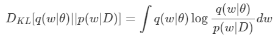

우리는 $w$를 연속으로 가정하고 있기 때문에 포스트와는 다르게 Integral 형태로 식을 작성하였다. 이제 위 식에 Bayesian Equation을 적용시키면 다음과 같이 전개할 수 있다.

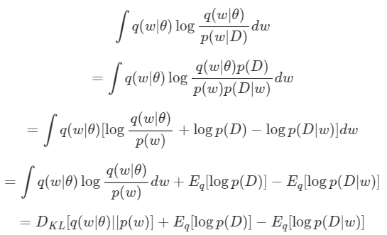

여기서 $\mathbb{E}_q [log\;p(D)]$는 $q$와 무관하므로 제거하면 최종적으로 우리는 다음 식을 **Minimize** 하는 $\theta$를 찾아야 한다. 

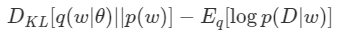

그렇게 $\theta$를 찾으면, 완벽히 같진 않겠지만 우리는 **$q(w\mid \theta)$를 $w$의 Posterior**라고 주장할 수 있게 된다.

왼쪽 항인 저 $D_{KL}[q(w\mid \theta )\mid \mid p(w)]$은 $D_{KL}[q(w\mid \theta)\mid \mid p(w|D)]$과는 달리 계산 가능한 값이다. $p(w)$도 알고 $q(w\mid \theta)$는 우리가 정의해주는 분포이기 때문이다. 

오른 쪽항인 $\mathbb{E}_q[log\; ⁡p(D\mid w)]$가 보인다. 기댓값 안에 있는 $log\; ⁡p(D\mid w)$는 **Likelihood**이다. 이 값을 Maximize 시킨다는 것인데, 이는 Maximum Likelihood Estimation(MLE)에 해당하기 때문에 일반적인 Neural Network를 학습시키는 일과 동치이다.(MLE&MLP post)

그런데 단순히 Neural Net을 학습시키는 것이 아니다. 그냥 Likelihood가 아니라 $q(w\mid \theta)$에 대한 Likelihood의 기댓값이기 때문이다. 여기에 우리는 Monte Carlo Method를 응용하도록 하자. 

$\mathbb{E}_q[log\; p(D\mid w)]$를 $q(w\mid \theta)$로부터 Sampling된 $w$인 $\bar{w}$에 대하여 $logp(D\mid \bar{w})$로 대체하는 것이다. 뭔가 복잡하지만, 정리하면 다음과 같다.

**$q(w\mid \theta)$로부터 sampling된 $w$에 대하여 얻은 output과 label 사이의 loss, 그리고 $D_{KL}[q(w\mid \theta)\mid \mid p(w)]$를 계산하여 얻은 식의 합을 최종적인 loss로 하여 back propagation을 진행한다. 학습되는 parameter는 $w$가 아니라 $q$의 parameter인 $θ$이다.**

### practical implement 

앞에서 너무 일반적인 얘기를 하여 이해가 어려우셨던 분들을 위해 실제 상황을 예로 들어 **Variational Inference**를 실제로 진행해보도록 할 것이다. 우리가 Bayesian Learning으로 학습할 Neural Network에는 N개의 parameter들 $w_1,w_2,…,w_N$이 있다고 하자. 먼저 Prior $p(w_i)$를 정해줘야 할 텐데, i 에 상관 없이 **Standard Normal Distribution**으로 가정하도록 하자.

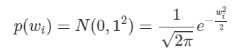

그리고 $q$또한 Gaussian으로 놓자. $w_i$는 i에 따라 다른 분포를 따를 수 있기 때문에 우리가 최적화시켜야 할 parameter들은 $\mu_i$와 $\sigma_i$로, 총 2N개가 된다. 그리고 $q(w_i\mid \mu_i,\sigma_i)$는 다음과 같다.

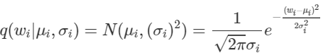

여기서 헷갈리면 안되는 게, 우리는 기존의 딥러닝처럼 $w_i$를 업데이트하는 것이 아니다. $\mu _i$와 $\sigma_i$를 업데이트 할 것이고, 이로부터 $w_i$가 sampling 되도록 할 것이다. 이제 정의해줘야 할 것들이 전부 충족되었으니, 다음 식을 통해 $D_{KL}[q(w_i\mid \mu_i, \sigma_i )\mid \mid p(w)]$를 먼저 계산해 놓도록 하자.

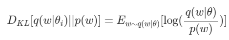

그 결과는 다음과 같게 된다.

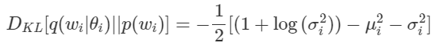

그리고 이를 Loss로 이용하기 위하여 상수배 Scale을 제거하고 모든 ii에 대한 합을 구하면 다음과 같은 Loss 식이 완성된다.

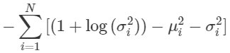

자, 이제 $\mathbb{E}_q[log\; ⁡p(D\mid w)]$ 항을 해결해야 하는데, 위에서 말했듯이 MLE에 해당하기 때문에 $w_i$들로 구성된 네트워크를 통과해서 나온 결과 값 $y$와 실제 값$t$ 사이의 loss를 구해서 backprop하면 되는 것이다. 간단하게 L2 Loss를 쓰도록 하자.

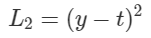

이제 마지막 관문이 남았다. $w_i$를 어떻게 sampling하냐는 것이다. 안타깝게도 단순히 $w_i$들을 각각의 distrbution에 따라 random sampling 하여 Neural Network에 집어 넣게 되면 $\mu_i$와 $\sigma_i$까지 gradient가 도달하게 만들 수 없다. Sampling 과정이 미분 불가능하기 때문이다. 그래서 다음과 같은 방법을 사용한다.

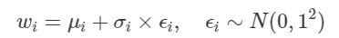

위 식을 통해 $w_i$를 sampling 하면 $w_i$까지 도달한 gradient를  $\mu_i$와 $\sigma_i$까지 propagate할 수 있다. 최종적으로 정리하자면, variational inference를 이용하여 $w_i$들을 알아내는 과정은 다음과 같다.

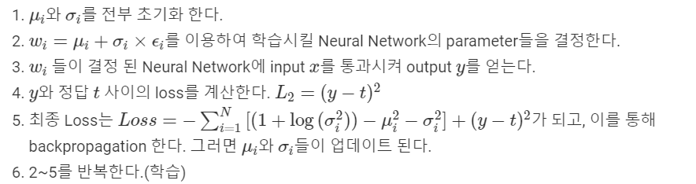

이런 과정을 통해 학습이 완료되면 우리는 최종적인  $\mu_i$와 $\sigma_i$들을 얻을 수 있고, 이렇게 얻은 값들을 parameter로 하는 gaussian distribution $q(w_i\mid \mu_i,\sigma_i)$를 우리는 $w_i$의 **Posterior**라고 말할 수 있다.

---

